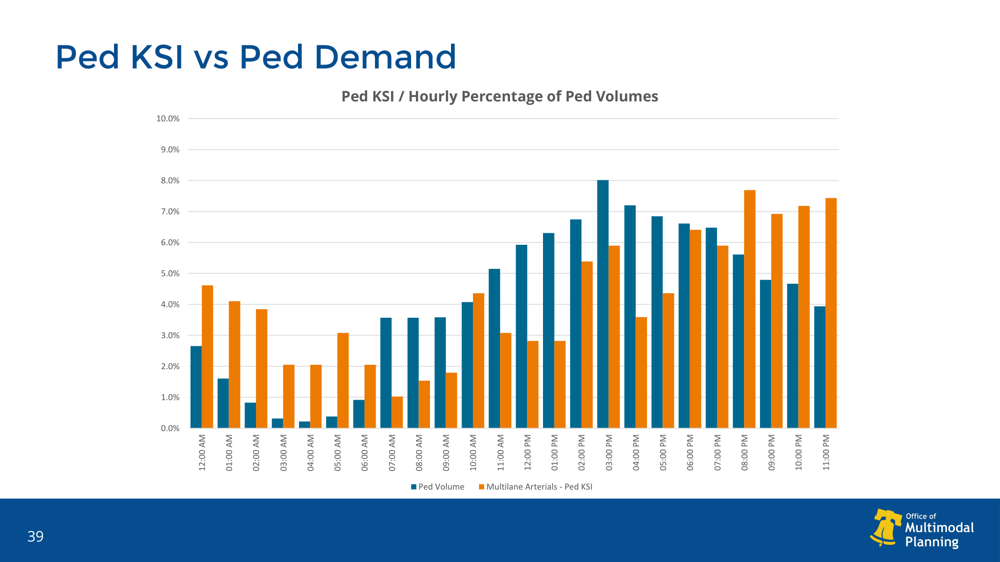
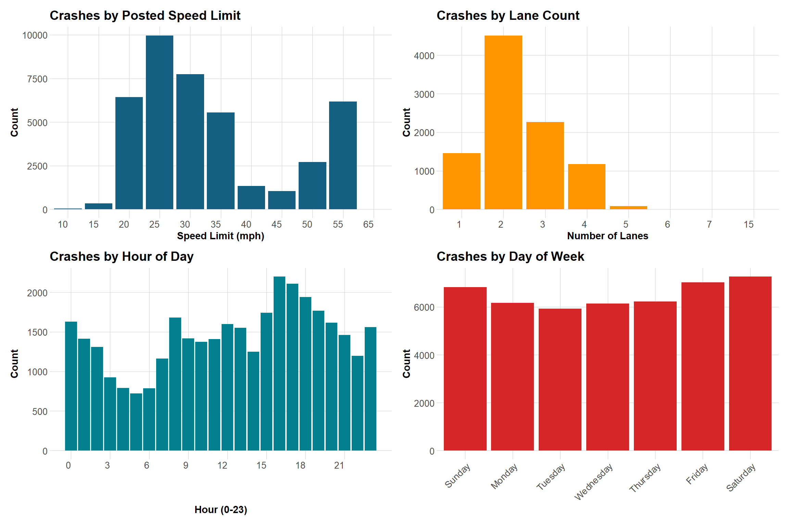
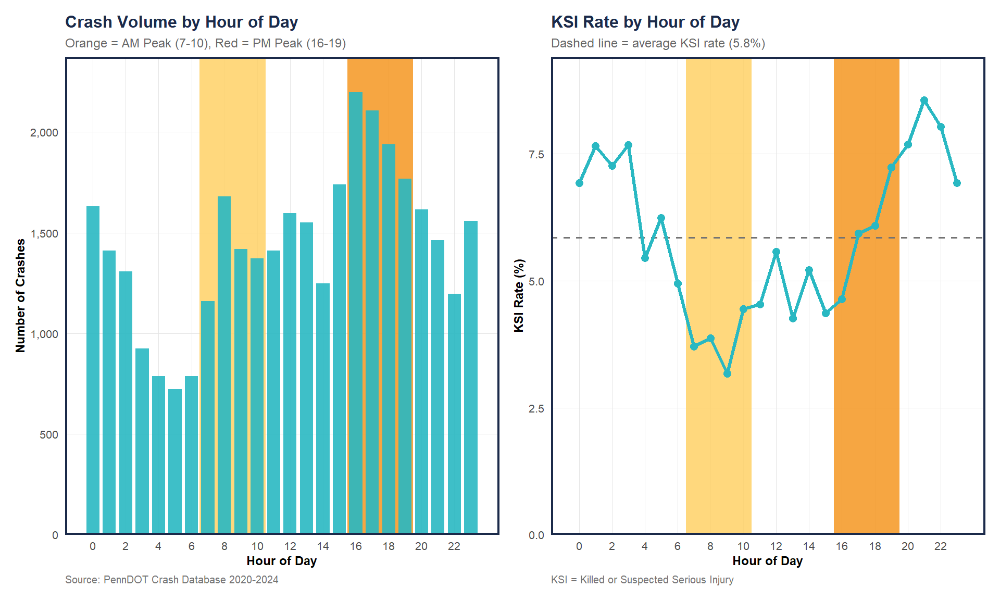
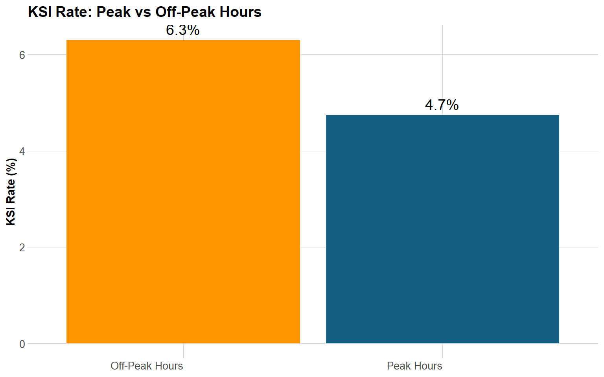
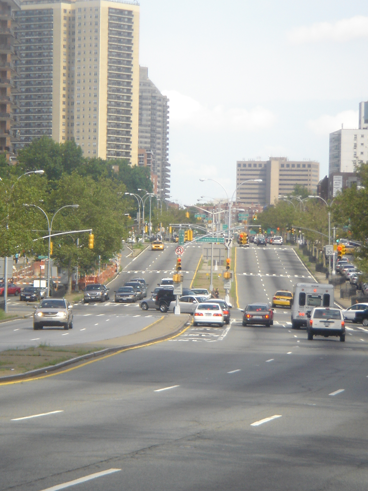
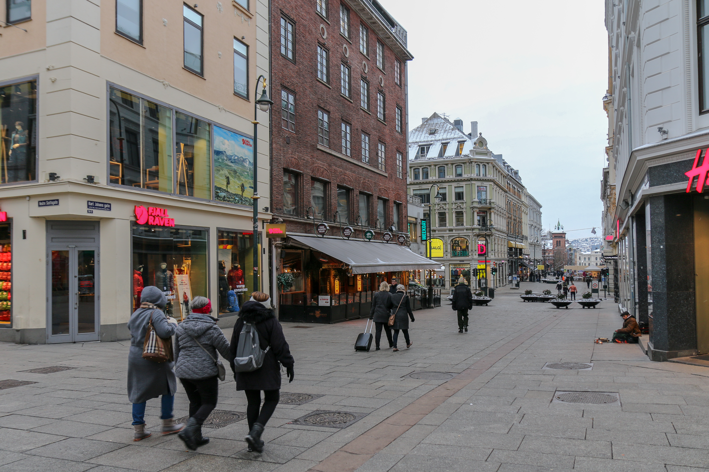
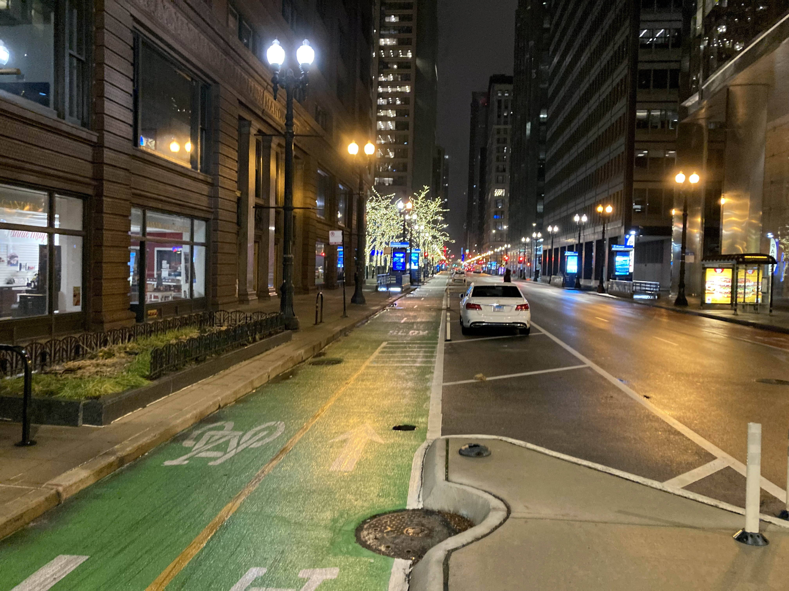

<style>
/* ---- Typography ---- */
body {
  font-family: "Lato", "Helvetica Neue", Helvetica, Arial, sans-serif;
  font-size: 15px;
  line-height: 1.7;
  color: #2c3e50;
}

h1.title {
  font-size: 36px;
  font-weight: 700;
  color: #156082;
  margin-bottom: 4px;
}

h3.subtitle {
  font-size: 20px;
  font-weight: 400;
  color: #555;
  margin-top: 0;
}

h1 { font-size: 30px; font-weight: 700; color: #156082; border-bottom: 2px solid #156082; padding-bottom: 6px; margin-top: 40px; }
h2 { font-size: 24px; font-weight: 600; color: #2c3e50; margin-top: 30px; }
h3 { font-size: 19px; font-weight: 600; color: #444; }
h4 { font-size: 16px; font-weight: 600; color: #555; }

/* ---- Accent colors ---- */
.accent-blue  { color: #156082; font-weight: 600; }
.accent-orange { color: #ff9500; font-weight: 600; }

/* ---- Callout boxes ---- */
.callout {
  padding: 14px 18px;
  margin: 20px 0;
  border-left: 5px solid #156082;
  background-color: #f0f6fa;
  border-radius: 0 6px 6px 0;
  font-style: italic;
  font-size: 15px;
  line-height: 1.6;
}

.callout-orange {
  border-left-color: #ff9500;
  background-color: #fff8ee;
}

.callout-finding {
  border-left-color: #27ae60;
  background-color: #f0faf4;
  font-style: normal;
}

/* ---- Stat highlight boxes ---- */
.stat-row {
  display: flex;
  gap: 16px;
  margin: 20px 0;
  flex-wrap: wrap;
}
.stat-box {
  flex: 1;
  min-width: 160px;
  background: #f7f9fc;
  border: 1px solid #dde3ea;
  border-radius: 8px;
  padding: 16px;
  text-align: center;
}
.stat-box .stat-num {
  font-size: 32px;
  font-weight: 700;
  color: #156082;
  display: block;
}
.stat-box .stat-num-orange {
  font-size: 32px;
  font-weight: 700;
  color: #ff9500;
  display: block;
}
.stat-box .stat-label {
  font-size: 12px;
  color: #777;
  margin-top: 4px;
  display: block;
}

/* ---- Tables ---- */
table {
  font-size: 13.5px;
}

/* ---- Misc ---- */
.note-to-reader {
  background: #fffbe6;
  border: 1px solid #ffe066;
  border-radius: 6px;
  padding: 12px 16px;
  font-size: 13.5px;
  margin-bottom: 24px;
}

hr { border-top: 1px solid #dde3ea; margin: 30px 0; }

img { border-radius: 4px; }

div.main-container { max-width: 1100px; }

/* ---- Leaflet/mapview width constraint ---- */
.html-widget.leaflet { max-width: 720px; margin-left: auto; margin-right: auto; display: block; }

/* ---- PDP sub-section separator ---- */
.pdp-section { margin-top: 40px; padding-top: 20px; border-top: 1px solid #e8ecef; }

/* ---- Case study photo ---- */
.case-photo { display: block; max-width: 80%; max-height: 420px; object-fit: cover; border-radius: 6px; margin: 16px auto; }
.case-caption { font-size: 12px; color: #777; text-align: center; margin-top: -8px; margin-bottom: 20px; }

/* ---- App preview card ---- */
.app-preview-link { display: block; position: relative; border-radius: 12px; overflow: hidden; box-shadow: 0 6px 24px rgba(0,0,0,0.14); text-decoration: none; }
.app-preview-link img { width: 100%; display: block; border-radius: 12px; }
.app-preview-overlay { position: absolute; inset: 0; background: rgba(21,96,130,0.55); border-radius: 12px; display: flex; flex-direction: column; align-items: center; justify-content: center; gap: 12px; opacity: 0; transition: opacity 0.2s; pointer-events: none; }
.app-preview-link:hover .app-preview-overlay { opacity: 1; }
.app-preview-overlay span.overlay-title { color: #fff; font-size: 22px; font-weight: 700; }
.app-preview-overlay span.overlay-btn { background: #ff9500; color: #fff; font-weight: 700; font-size: 14px; padding: 10px 28px; border-radius: 6px; }
</style>

```{r setup, include=FALSE}
knitr::opts_chunk$set(
  warning  = FALSE,
  message  = FALSE,
  echo     = TRUE,
  fig.align = "center"
)
```

```{r libraries, message=FALSE, warning=FALSE}
library(tidyverse)
library(tidylog)
library(janitor)
library(scales)
library(sf)
library(tidymodels)
library(knitr)
library(kableExtra)
library(patchwork)
library(DALEXtra)
library(pdp)
library(boxr)
library(mapview)

# Box authentication (run once per session)
box_auth()
```


```{r palette-setup, message=FALSE, warning=FALSE}
# Project color palette — matched to maps and charts throughout
roadway_colors <- c("#ff9500", "#ffd000", "#00badb", "#156082")
names(roadway_colors) <- c("Major Arterial", "Minor Arterial", "Collector", "Local")

palette_orange <- "#ff9500"   # Major Arterial / highlight
palette_yellow <- "#ffd000"   # Minor Arterial
palette_cyan   <- "#00badb"   # Collector
palette_blue   <- "#156082"   # Local / primary headings

speed_detail_colors <- c(
  "1-10mph over speed limit"         = "#ff9500",
  "11-15mph over speed limit"        = "#ffd000",
  "16-20mph over speed limit"        = "#00badb",
  "More than 20mph over speed limit" = "#156082"
)

theme_set(theme_light(base_size = 12))
```

<div class="note-to-reader">
**A note to the reader:** This document presents the complete analysis pipeline for the MUSA 801 Practicum project on off-peak roadway safety, conducted in partnership with the City of Philadelphia's Office of Transportation and Infrastructure Systems (OTIS). Raw data are stored in a shared Box repository and loaded via the `boxr` API. Code chunks marked `eval=FALSE` contain the exact processing logic but are not re-executed here to avoid re-downloading large datasets. Pre-processed outputs are loaded directly from Box where needed. Raw and processed data which are publicly sharable are also stored in the project Github repository, located [here](https://github.com/chihyunkim/otis_off_peak_roadway_safety).
</div>

---

# 1. Use Case

## 1.1 Background

Most roadway design criteria target peak-hour travel, when congestion is most severe. Yet a quieter, more lethal phenomenon unfolds each night: when the same roads that efficiently move rush-hour traffic fall silent, they become something far more dangerous.

Wide arterials and multi-lane collectors, engineered to manage thousands of vehicles per hour, become unobstructed corridors after 10 PM. A crash at 50 mph on an empty road at 2 AM is not an anomaly — it is a structural outcome, predicted by the design of the road itself.

<div class="callout">
*"Speed is the number one determinant of severity in a crash — as speed increases so does the probability of crash fatalities and serious injuries."*
<br>— DVRPC Arterial Typology & Speed Management Framework, 2022
</div>

### The Off-Peak Safety Paradox

Philadelphia's Office of Multimodal Planning documented this pattern directly in an analysis of eight multilane arterials on the city's High Injury Network (OTIS Office of Multimodal Planning, "Evaluating the Off-Peak Impacts of Designing for Peak Hour Operations," TESC, December 2024; internal report). The finding is stark:

Evening hours (8 PM–3 AM) represent only **29% of the day** and carry just **14% of daily traffic volume** — yet they account for **46% of all pedestrian KSI crashes**. Peak hours (7–10 AM, 3–7 PM), despite representing the same share of time (29%) and three times the traffic share (42%), produce only 26% of KSI crashes. The conclusion is direct: **LOS A — free-flow traffic — is not safe. Excess capacity kills.**

The hourly KSI-to-demand ratio tells the same story at finer resolution: during overnight hours, the KSI share (orange) rises sharply while the traffic share (black) falls — creating the inverse pattern that defines the off-peak paradox. The divergence is most extreme between midnight and 7 AM, when pedestrian KSI rates are 3–5× higher per unit of traffic than during midday hours.

```{r ksi-hourly-intro, echo=FALSE, out.width="85%", fig.cap="Ped KSI crashes vs. hourly traffic share by hour of day across Philadelphia multilane arterials. Orange = pedestrian KSI share; Black = hourly traffic share (% of AADT). Source: OTIS Office of Multimodal Planning, TESC, December 2024 (internal report)."}

```

<div class="callout callout-orange">
*"LOS A is dangerous for vulnerable road users because it allows for unmetered speeding by drivers."*
<br>— OTIS Office of Multimodal Planning, *Evaluating the Off-Peak Impacts of Designing for Peak Hour Operations*, TESC, December 2024 (internal report)
</div>

### Why Road Design Makes Drivers Speed

The off-peak paradox is not simply about fewer cars at night. It is about what wide, multi-lane roads do to driver cognition and behavior. Research by Tice et al. (2021), using naturalistic driving data from 200 urban locations, found that corridor width is the single strongest predictor of 85th percentile speed (r = 0.686) — stronger than speed limits, land use, or neighborhood density.

The mechanism operates through **driver attention**. Wide corridors with few visual interruptions trigger a near-automatic driving state — the same attentional mode activated on highways — in which drivers perceive minimal risk and unconsciously increase speed.

The same study found that at speeds above 45 mph, drivers cannot reliably decode facial expressions — meaning they may not register a pedestrian's presence before passing them. This is not distraction or recklessness; it is the predictable neurological response to a road environment designed for highway-speed throughput.

A natural experiment during COVID-19 lockdowns confirmed this mechanism: when pedestrian activity dropped during shelter-in-place orders, driving speeds on urban arterials increased substantially — the same roads, the same drivers, but an environment that no longer signaled human presence (Tice et al., 2021).

### The Philadelphia Context

DVRPC's 2022 Arterial Typology and Speed Management Framework identified **623 miles of arterial roads** in Philadelphia — 50% PennDOT-owned, 50% city-owned — as requiring structured speed management. The report found that because most city streets already operate below target speeds during congested peak hours, standard traffic engineering's focus on peak capacity systematically neglects the more dangerous off-peak window:

<div class="callout">
*"Installing traffic calming can greatly improve target speed-compliance at off-peak times when speeding is more likely and LOS levels have minimal delay."*
<br>— DVRPC Arterial Typology & Speed Management Framework, 2022
</div>

Research from Northeastern University (Furth et al., 2024) further demonstrated that on multilane arterials — where physical calming cannot always be deployed — redesigned signal timing ("Safe Waves") reduced the number of speeding vehicles by **75%** with fewer than 2 seconds of added travel delay per intersection. The implication: the off-peak speeding problem is not intractable. It is a design problem, and it has design solutions.

### This Project

The City of Philadelphia's Office of Transportation and Infrastructure Systems (OTIS), Office of Multimodal Planning, commissioned this study to shift from a reactive safety paradigm — responding to crash histories — toward a **predictive, planning-oriented** one. Rather than waiting for the next fatality to identify a dangerous corridor, the goal is to predict which road segments are structurally predisposed to off-peak speeding and simulate which interventions would reduce that risk most effectively.

## 1.2 Study Area

The study covers **Philadelphia, Pennsylvania**, with a focus on 446 unique road segments equipped with speed measurement sensors distributed across arterial and collector streets citywide. These segments span a range of road types — from major arterials like Roosevelt Boulevard to neighborhood collectors — and carry speed monitoring data from 2022 to 2025.

Each segment is identified by a unique `seg_id` drawn from the Philadelphia Street Centerline dataset. All spatial analysis uses **EPSG:2272 (NAD83 / Pennsylvania South)** for foot-level precision.

```{r study-area-map, message=FALSE, warning=FALSE}
# Load centerlines geometry (reused in crash maps later)
centerlines_geometry <- box_read_rds(2139915462983) %>%
  mutate(seg_id = as.character(seg_id)) %>%
  st_transform(crs = "EPSG:2272")

# Load processed speed data — monitoring point coordinates + seg_id
speed_pts_raw <- box_read_rds(2193174265310)

# Monitored segments: filter centerlines to the 446 monitored seg_ids
monitored_seg_ids <- speed_pts_raw %>%
  distinct(seg_id) %>%
  mutate(seg_id = as.character(seg_id)) %>%
  pull(seg_id)

monitored_segments <- centerlines_geometry %>%
  filter(seg_id %in% monitored_seg_ids) %>%
  st_transform("EPSG:4326")

# Monitoring point locations (one point per recordnum)
speed_pts <- speed_pts_raw %>%
  distinct(recordnum, speed_measurement_longitude, speed_measurement_latitude,
           speed_measurement_road) %>%
  filter(!is.na(speed_measurement_longitude), !is.na(speed_measurement_latitude)) %>%
  st_as_sf(coords = c("speed_measurement_longitude", "speed_measurement_latitude"),
           crs = "EPSG:4326")

mapviewOptions(legend.pos = "bottomright")
mapview(monitored_segments,
        color      = palette_orange,
        lwd        = 2,
        alpha      = 0.9,
        label      = monitored_segments$road,
        layer.name = paste0("Speed sensor segments (n = ", nrow(monitored_segments), ")"),
        map.types  = "CartoDB.Positron")
```

## 1.3 Methodology Overview

Our methodology proceeds in three stages, each building on the last:

**Stage 1 — Establish the problem empirically.** Using five years of crash records (2020–2024), we quantify whether off-peak crashes are truly more lethal, and whether speeding-involved crashes concentrate outside peak hours. These analyses provide the empirical grounding for the modeling work.

**Stage 2 — Build a predictive model.** We train a Random Forest regression model to predict the percentage of vehicles speeding on a given segment during a given hour, as a function of structural road characteristics, temporal controls, and contextual features. The model achieves **R² = 0.920** on and mean absolute error of 4 percentage points on held-out test data.

**Stage 3 — Support planning decisions.** The model enables counterfactual simulation: if this road were placed on a road diet (lanes reduced), or a separated bike lane added, how much would predicted speeding rates change? These outputs help planners prioritize investments where structural changes produce the largest safety gains.

---

# 2. Exploratory Data Analysis

## 2.1 Data Sources

All data were assembled from public open data portals, PennDOT administrative databases, and client-provided files stored in a shared Box repository.

```{r data-sources-table, echo=FALSE}
data_sources <- tribble(
  ~`#`, ~Dataset,                          ~Source,                              ~`Role in Analysis`,
  "1",  "Crash Records (2020–2024)",        "PennDOT Statewide / OpenDataPhilly", "KSI validation; crash rates per segment",
  "2",  "Speed Data",                       "Philadelphia County Speed CSVs (Box)", "**Primary modeling outcome** (% speeding)",
  "3",  "Volume Data",                      "PennDOT TIRE axle counts (Box)",     "Traffic volume denominator",
  "4",  "Street Centerlines",               "OpenDataPhilly",                     "Base network; seg_id join key",
  "5",  "RMS Admin Segments",               "GISDATA_RMSADMIN.shp (Box)",         "Road geometry; surface width",
  "6",  "Complete Streets / DVRPC",         "DVRPC",                              "Road typology, lanes, width",
  "7",  "Traffic Calming Devices",          "PennDOT Open Data / Box",            "Speed humps, cushions — road diet proxy",
  "8",  "Intersection Controls",            "OpenDataPhilly",                     "Stop signs, signals — node friction",
  "9",  "Streetlights / Street Poles",      "OpenDataPhilly",                     "Nighttime visibility proxy",
  "10", "Bike Network",                     "OpenDataPhilly",                     "Bike lane type — road diet indicator",
  "11", "Bus Stops / Transit",              "SEPTA",                              "Pedestrian activity zones",
  "12", "Red Light Cameras",                "PPA / OpenDataPhilly",               "Enforcement; driver behavior signal",
  "13", "PA TIP Projects",                  "DVRPC / PennDOT",                   "Planned/recent construction context",
  "14", "OpenStreetMap (OSM)",              "osmdata R package",                 "Supplemental road characteristics (pre-hand-check)",
  "15", "OPA Properties Data",              "OpenDataPhilly",                     "Parcel density as land-use activity proxy"
)

data_sources %>%
  kbl(align = c("c", "l", "l", "l"), escape = FALSE) %>%
  kable_classic(full_width = TRUE, html_font = "Lato") %>%
  kable_styling(font_size = 13) %>%
  row_spec(2, bold = TRUE, background = "#f0f6fa") %>%
  column_spec(1, bold = TRUE, width = "2em") %>%
  column_spec(2, width = "18em")
```

## 2.2 Crash Analysis (2020–2024)

### 2.2.1 Data Overview

```{r load-crash-data, eval=FALSE}
# Load and harmonize five years of PennDOT crash records
crash_years <- list(
  box_read_csv("2129578929490"),  # 2020
  box_read_csv("2129584283678"),  # 2021
  box_read_csv("2129572753523"),  # 2022
  box_read_csv("2129590204560"),  # 2023
  box_read_csv("2129573871742")   # 2024
)

# Harmonize schema differences across years
all_crashes <- crash_years %>%
  map(~ mutate(.x,
               WEATHER1    = as.character(WEATHER1),
               TCD_FUNC_CD = as.character(TCD_FUNC_CD))) %>%
  bind_rows() %>%
  filter(COUNTY == "67")    # Philadelphia only
```

```{r feature-engineering, eval=FALSE}
philly_crashes <- all_crashes %>%
  mutate(
    hour_raw        = str_sub(as.character(TIME_OF_DAY), 1, 2),
    HOUR_OF_DAY     = as.integer(hour_raw),
    HOUR_OF_DAY     = if_else(HOUR_OF_DAY == 99, NA_integer_, HOUR_OF_DAY),

    is_ksi          = if_else(FATAL_OR_SUSP_SERIOUS_INJ == "1", 1, 0, missing = 0),

    time_period     = case_when(
      HOUR_OF_DAY >= 7  & HOUR_OF_DAY < 10 ~ "AM Peak (7–10)",
      HOUR_OF_DAY >= 16 & HOUR_OF_DAY < 19 ~ "PM Peak (16–19)",
      HOUR_OF_DAY >= 10 & HOUR_OF_DAY < 16 ~ "Midday (10–16)",
      HOUR_OF_DAY >= 19 & HOUR_OF_DAY < 22 ~ "Evening (19–22)",
      HOUR_OF_DAY >= 22 | HOUR_OF_DAY < 7  ~ "Night/Late (22–7)",
      TRUE ~ "Unknown"
    ),

    is_peak         = if_else(
      time_period %in% c("AM Peak (7–10)", "PM Peak (16–19)"), 1, 0),
    is_weekend      = if_else(DAY_OF_WEEK %in% c(1, 7), 1, 0, missing = 0),
    SPEEDING_RELATED = as.integer(SPEEDING_RELATED)
  ) %>%
  mutate(
    time_period = factor(time_period, levels = c(
      "AM Peak (7–10)", "Midday (10–16)", "PM Peak (16–19)",
      "Evening (19–22)", "Night/Late (22–7)", "Unknown"))
  )
```

After filtering to Philadelphia (county code 67) and harmonizing schema differences across years, the combined dataset contains more than **16,000 crashes** with GPS coordinates, timestamps, severity indicators, and roadway context variables. The PennDOT crash records have three sub-tables per year (crash master, flags, and roadway); we join all three on `CRN`, then filter to Philadelphia (`COUNTY == "67"`).

```{r feature-distributions-img, echo=FALSE, out.width="100%", fig.cap="Crash distributions by posted speed limit, lane count, hour of day, and day of week (2020–2024). Crashes concentrate on 25–35 mph corridors, on 2–4 lane roads, in afternoon hours, and on weekdays."}

```

### 2.2.2 The Off-Peak Paradox: Fewer Crashes, More Deaths

This is the empirical heart of the project. When crash counts and KSI rates are plotted by hour of day, a striking inversion emerges:

```{r hourly-patterns-img, echo=FALSE, out.width="100%"}

```

- **Peak hours (7–10 AM, 4–7 PM):** Crash volume is highest, but the KSI rate is lowest. Congestion keeps speeds down; most crashes are low-severity.
- **Night/Late hours (10 PM–7 AM):** Crash volume is lowest, but the KSI rate climbs steadily, peaking between 2–4 AM.

You are far more likely to be in a fender-bender at 5 PM than at 3 AM — but far more likely to be killed or seriously injured at 3 AM than at 5 PM.

### 2.2.3 Peak vs. Off-Peak: Statistical Test

```{r peak-offpeak, eval=FALSE}
peak_comparison <- philly_crashes %>%
  filter(!is.na(HOUR_OF_DAY)) %>%
  mutate(period_type = if_else(is_peak == 1, "Peak Hours", "Off-Peak Hours")) %>%
  group_by(period_type) %>%
  summarise(
    total_crashes  = n(),
    ksi_crashes    = sum(is_ksi),
    ksi_rate       = ksi_crashes / total_crashes * 100,
    speeding_rate  = sum(SPEEDING_RELATED, na.rm = TRUE) / total_crashes * 100
  )

# Chi-squared test for KSI rate difference
ksi_test <- prop.test(
  x = c(sum(philly_crashes$is_ksi[philly_crashes$is_peak == 0], na.rm = TRUE),
        sum(philly_crashes$is_ksi[philly_crashes$is_peak == 1], na.rm = TRUE)),
  n = c(sum(philly_crashes$is_peak == 0, na.rm = TRUE),
        sum(philly_crashes$is_peak == 1, na.rm = TRUE))
)
```

```{r peak-viz-img, echo=FALSE, out.width="70%", fig.cap="KSI rate is significantly higher during off-peak hours — a difference confirmed by chi-squared test (p < 0.05)."}

```

<div class="callout callout-finding">
A chi-squared proportion test confirms that the KSI rate difference between peak and off-peak hours is **statistically significant** (p < 0.05), consistent across all five years of data (2020–2024).
</div>

### 2.2.4 Spatial Distribution

```{r crash-spatial-setup, message=FALSE, warning=FALSE}
crash_summary <- box_read_csv(2195155235316) %>%
  mutate(seg_id = as.character(seg_id))

# centerlines_geometry already loaded in study-area-map chunk
crash_network <- centerlines_geometry %>%
  left_join(crash_summary, by = "seg_id") %>%
  mutate(total_crashes = replace_na(total_crashes, 0),
         ksi_crashes   = replace_na(ksi_crashes,   0))
```

#### Total Crash Density by Segment (2020–2024)

```{r map-all-crashes-full, message=FALSE, warning=FALSE, fig.height=7}
crash_with_crashes <- crash_network %>% filter(total_crashes > 0) %>% arrange(total_crashes)

ggplot() +
  geom_sf(data = crash_network, color = "#e0e4ea", linewidth = 0.15) +
  geom_sf(data = crash_with_crashes, aes(color = total_crashes), linewidth = 1.0) +
  scale_color_viridis_c(name = "Total crashes\n(2020–2024)",
                        trans = "log1p", option = "inferno",
                        direction = -1,
                        labels = scales::comma) +
  labs(title   = "Total Crash Density by Segment",
       caption = "Source: PennDOT crash records, Philadelphia Street Centerlines") +
  theme_void() +
  theme(plot.title      = element_text(size = 14, face = "bold", color = palette_blue),
        legend.position = "right")
```

Crashes are distributed across the entire city, with the highest concentrations along major corridors in North, West, and South Philadelphia. The spatial pattern closely tracks traffic volume — high-density street grids and major arterials dominate the crash count map.

#### KSI Crash Density by Segment (2020–2024)

```{r map-ksi-crashes-full, message=FALSE, warning=FALSE, fig.height=7}
crash_with_ksi <- crash_network %>% filter(ksi_crashes > 0) %>% arrange(ksi_crashes)

ggplot() +
  geom_sf(data = crash_network, color = "#e0e4ea", linewidth = 0.15) +
  geom_sf(data = crash_with_ksi, aes(color = ksi_crashes), linewidth = 1.0) +
  scale_color_viridis_c(name = "KSI crashes\n(2020–2024)",
                        trans = "log1p", option = "mako",
                        direction = -1,
                        labels = scales::comma) +
  labs(title   = "KSI Crash Density by Segment",
       caption = "Source: PennDOT crash records, Philadelphia Street Centerlines") +
  theme_void() +
  theme(plot.title      = element_text(size = 14, face = "bold", color = palette_blue),
        legend.position = "right")
```

The KSI map tells a strikingly different story. Fatal and serious-injury crashes do not concentrate in the same places as overall crash volume. Instead, they cluster along **wide, multi-lane arterials** — particularly at the city's periphery where road geometry is built for higher speeds. This spatial divergence is a key policy signal: corridors with the most crashes are not necessarily the most dangerous ones.

Comparing the two maps: **high total-crash corridors** (dense inner-city grid) and **high KSI corridors** (peripheral wide arterials) diverge spatially, confirming that volume-based and severity-based risk measures identify fundamentally different problems. Planning responses that target only crash frequency will systematically miss the most deadly corridors.

## 2.3 Speed & Volume Data

### 2.3.1 Data Loading

Speed and volume data are provided as annual CSV files in a shared Box folder. They are read in batch using a helper function and joined with the `recordnum` key.

```{r read-speed-volume, eval=FALSE}

box_raw_data_folder       <- 362958311858
box_processed_data_folder <- 362958210990

# List files in the speed/volume folder
speed_volume_files <- box_ls(359822034820) %>% as_tibble()
speed_files  <- speed_volume_files %>% filter(str_detect(name, "Speed"))
volume_files <- speed_volume_files %>% filter(str_detect(name, "Volume"))

# Batch-read all CSVs from Box
batch_read_files <- function(data_files_info) {
  map2(data_files_info$id, data_files_info$name,
       ~ box_read_csv(.x) %>%
           mutate(across(where(is.character), ~ na_if(., "")),
                  source = .y, .before = everything())) %>%
    list_rbind()
}

speed_data_initial <- batch_read_files(speed_files) %>%
  clean_names() %>%
  mutate(year = as.numeric(str_extract(source, "\\d{4}")),
         countdate = mdy(countdate))

volume_data_initial <- batch_read_files(volume_files) %>%
  clean_names() %>%
  mutate(year = as.numeric(str_extract(source, "\\d{4}")),
         countdate = mdy(countdate))

# Load pre-processed speed data from Box (used in all analyses below)
speed <- box_read_rds(2171353657698) %>%
  mutate(seg_id = as.character(seg_id),
         speed_measurement_hour = str_pad(as.character(speed_measurement_hour),
                                          width = 2, side = "left", pad = "0"),
         speed_measurement_month = str_pad(as.character(speed_measurement_month),
                                           width = 2, side = "left", pad = "0"))
```

### 2.3.2 Data Structure

Speed data are collected via pneumatic tube counters, providing **hourly vehicle counts broken down into 5 mph speed bins** for each measurement location and year. Key fields:

- `recordnum`: unique measurement session identifier — the most reliable row-level key (no duplicates at hour 0)
- `countdate`, `count_hr`: date and hour of measurement (0–23)
- Speed bin columns: vehicle counts per 5 mph increment (e.g., `speed_21_25`, `speed_26_30`, ...)
- `speedlimit`: posted speed limit

### 2.3.3 Data Preparation: Long Format & Speeding Categories

```{r speed-long-format, eval=FALSE}
speed_data_long <- speed_data_initial %>%
  left_join(volume_data_initial %>%
              select(recordnum, countdate, count_hr, volcount),
            by = c("recordnum", "countdate", "count_hr")) %>%
  mutate(volume_total = case_when(
    is.na(volcount)              ~ total,
    volcount == 0 & total != 0   ~ total,
    total > volcount             ~ total,
    .default = volcount)) %>%
  select(year, recordnum, speedlimit, road, fromlmt, tolmt,
         countdate, count_hr, volume_total, contains("speed_")) %>%
  pivot_longer(contains("speed_"),
               values_to = "count",
               names_to  = c("range_low", "range_high"),
               names_pattern = "speed_(\\d+)_(\\d+)") %>%
  mutate(range_low  = as.numeric(range_low),
         range_high = as.numeric(range_high)) %>%
  # Binary: speeding / not speeding
  mutate(speed_category_binary =
           if_else(range_high > speedlimit, "Speeding", "Not speeding")) %>%
  # Detailed: how far over the limit
  mutate(speed_category_detailed = case_when(
    range_high <= speedlimit             ~ "Not speeding",
    range_low  > speedlimit + 20         ~ "More than 20mph over",
    range_low  > speedlimit + 15         ~ "16–20mph over",
    range_low  > speedlimit + 10         ~ "11–15mph over",
    range_low  > speedlimit +  0         ~ "1–10mph over",
    .default = "CHECK")) %>%
  mutate(speed_category_detailed = fct_relevel(
    speed_category_detailed,
    "Not speeding", "1–10mph over", "11–15mph over",
    "16–20mph over", "More than 20mph over")) %>%
  # Time of day
  mutate(time_of_day = case_when(
    count_hr >= 20 ~ "Off-peak",
    count_hr >= 16 ~ "Peak",
    count_hr >= 11 ~ "Off-peak",
    count_hr >=  7 ~ "Peak",
    count_hr >=  0 ~ "Off-peak")) %>%
  mutate(period_of_day = case_when(
    count_hr >= 20 ~ "Off-peak (night)",
    count_hr >= 16 ~ "Peak (evening)",
    count_hr >= 11 ~ "Off-peak (midday)",
    count_hr >=  7 ~ "Peak (morning)",
    count_hr >=  0 ~ "Off-peak (night)")) %>%
  mutate(period_of_day = fct_relevel(
    period_of_day,
    "Off-peak (night)", "Off-peak (midday)",
    "Peak (evening)",   "Peak (morning)"))
```

### 2.3.4 Data Coverage

```{r coverage-table, echo=FALSE}
coverage <- tribble(
  ~Year, ~`Speed Records`, ~`Volume Records`, ~`Share`,
  "2022", "~25,776", "~25,248", "46.5%",
  "2023", "~14,712", "~14,736", "26.5%",
  "2021", "~8,592",  "~8,256",  "15.5%",
  "2024", "~6,408",  "~6,432",  "11.5%"
)

coverage %>%
  kbl(align = "c") %>%
  kable_classic(full_width = FALSE, html_font = "Lato") %>%
  kable_styling(font_size = 13) %>%
  row_spec(1, bold = TRUE, background = "#f0f6fa") %>%
  add_footnote("Speed and volume record counts are nearly identical within each year, confirming strong dataset alignment.",
               notation = "none")
```

2022 dominates at ~46% of all hourly records. **Measurement dates vary systematically from year to year** — including months covered, weekday/weekend share, and hourly completeness. Coverage through the hours of the day is even (one row per hour per measurement session).

```{r temporal-coverage, eval=FALSE}
# Temporal coverage: measurement instances by date and year
speed_data_temporal <- speed_data_initial %>%
  group_by(year, countdate) %>%
  summarise(instances = n_distinct(aadv), .groups = "drop") %>%
  mutate(weekday = wday(countdate, label = TRUE),
         weekend = if_else(weekday %in% c("Sat", "Sun"), "Weekend", "Weekday"),
         month   = month(countdate, label = TRUE))

# Monthly breakdown with weekday/weekend split
speed_data_temporal %>%
  group_by(year, month, weekend) %>%
  summarise(instances = sum(instances), .groups = "drop") %>%
  ggplot(aes(x = month, y = instances, fill = weekend)) +
  geom_col(position = position_stack()) +
  scale_fill_manual(values = c(Weekday = palette_blue, Weekend = palette_cyan)) +
  facet_wrap(~ year, ncol = 2) +
  labs(title    = "Measurement instances by month and weekday/weekend status",
       subtitle = "Temporal distribution varies substantially across years",
       x = NULL, y = "Measurement instances", fill = NULL)
```

### 2.3.5 Spatial Coverage & Roadway Types

Joining speed measurement coordinates to Philadelphia street centerlines spatially (nearest-feature snap), we classify each measurement point by roadway type.

```{r centerlines-join, eval=FALSE}
# Load centerlines from Box
centerlines <- box_read_rds(2139915462983) %>%
  mutate(roadway_type = case_when(
    class == 2  ~ "Major Arterial",
    class == 3  ~ "Minor Arterial",
    class == 4  ~ "Collector",
    class == 5  ~ "Local",
    class == 9  ~ "Low Speed Ramps",
    class == 10 ~ "High Speed Ramps",
    class == 1  ~ "Expressways",
    TRUE        ~ NA_character_)) %>%
  filter(!is.na(roadway_type)) %>%
  select(seg_id, roadway_type) %>%
  mutate(centerlines_index = row_number()) %>%
  st_transform("EPSG:2272")

# Snap speed measurement points to nearest centerline
speed_data_coords <- speed_data_initial %>%
  distinct(recordnum, longitude, latitude) %>%
  st_as_sf(coords = c("longitude", "latitude"), crs = "EPSG:4326") %>%
  st_transform("EPSG:2272")

nearest_idx <- st_nearest_feature(speed_data_coords, centerlines)
speed_data_centerlines <- speed_data_coords %>%
  mutate(centerlines_index = centerlines$centerlines_index[nearest_idx]) %>%
  left_join(centerlines %>% st_drop_geometry(), by = "centerlines_index")

# Map monitored segments by roadway type
mapview(speed_data_centerlines %>%
          filter(!roadway_type %in% c("High Speed Ramps","Low Speed Ramps","Expressways")) %>%
          mutate(roadway_type = fct_relevel(roadway_type,
            "Major Arterial","Minor Arterial","Collector","Local")),
        zcol       = "roadway_type",
        color      = roadway_colors,
        lwd        = 4,
        layer.name = "Roadway type")
```

Highway and ramp measurement points are **excluded from all analyses** below. The distribution of remaining measurement points by roadway type is:

```{r roadway-type-table, echo=FALSE}
tribble(
  ~`Roadway Type`,   ~N,    ~Percent,
  "Major Arterial",  "230", "41.97%",
  "Minor Arterial",  "166", "30.29%",
  "Collector",       "132", "24.09%",
  "Local",           " 20", " 3.65%"
) %>%
  kbl(align = c("l","r","r")) %>%
  kable_classic(full_width = FALSE, html_font = "Lato") %>%
  kable_styling(font_size = 13) %>%
  row_spec(1, background = "#fff3e0") %>%
  row_spec(2, background = "#fffde7") %>%
  row_spec(3, background = "#e0f7fa") %>%
  row_spec(4, background = "#e3f0f8")
```

```{r speed-eda-load, message=FALSE, warning=FALSE}
# ── Load raw speed and volume data from Box ──────────────────────────────────
speed_data_initial <- box_read_rds(2133989776667)
volume_data_initial <- box_read_rds(2133996962286)

# ── Build long-format speed data (exact same pipeline as speed_volume_data_eda.Rmd) ──
speed_data_long <- speed_data_initial %>%
  left_join(volume_data_initial %>%
              select(recordnum, countdate, count_hr, volcount),
            by = c("recordnum", "countdate", "count_hr")) %>%
  mutate(volume_total =
           case_when(is.na(volcount)             ~ total,
                     volcount == 0 & total != 0  ~ total,
                     total > volcount             ~ total,
                     .default = volcount)) %>%
  select(year, recordnum, speedlimit, road, fromlmt, tolmt,
         countdate, count_hr, volume_total, contains("speed_")) %>%
  pivot_longer(contains("speed_"),
               values_to = "count",
               names_to  = c("range_low", "range_high"),
               names_pattern = "speed_(\\d+)_(\\d+)") %>%
  mutate(speed_category_binary =
           if_else(as.numeric(range_high) > speedlimit, "Speeding", "Not speeding")) %>%
  mutate(speed_category_detailed =
           case_when(as.numeric(range_high) <= speedlimit                  ~ "Not speeding",
                     as.numeric(range_low)  > speedlimit + 20              ~ "More than 20mph over speed limit",
                     as.numeric(range_low)  > speedlimit + 15              ~ "16-20mph over speed limit",
                     as.numeric(range_low)  > speedlimit + 10              ~ "11-15mph over speed limit",
                     as.numeric(range_low)  > speedlimit +  0              ~ "1-10mph over speed limit",
                     .default = "CHECK")) %>%
  mutate(speed_category_detailed =
           fct_relevel(speed_category_detailed,
                       "Not speeding",
                       "1-10mph over speed limit",
                       "11-15mph over speed limit",
                       "16-20mph over speed limit",
                       "More than 20mph over speed limit")) %>%
  mutate(speeding      = if_else(as.numeric(range_high) > speedlimit,      "Speeding",      "Not speeding")) %>%
  mutate(high_speeding = if_else(as.numeric(range_high) > speedlimit + 10, "High speeding", "Not high speeding"))

# ── Join to centerlines to get roadway_type ───────────────────────────────────
centerlines_raw <- box_read_rds(2139915462983)

centerlines_ready <- centerlines_raw %>%
  mutate(roadway_type =
           case_when(class == 0  ~ "Navy Yard",
                     class == 1  ~ "Expressways",
                     class == 2  ~ "Major Arterial",
                     class == 3  ~ "Minor Arterial",
                     class == 4  ~ "Collector",
                     class == 5  ~ "Local",
                     class == 6  ~ "Driveway",
                     class == 9  ~ "Low Speed Ramps",
                     class == 10 ~ "High Speed Ramps",
                     class == 12 ~ "Non Travable",
                     class == 14 ~ "City Boundary",
                     class == 15 ~ "Walking Connector",
                     class == 18 ~ "Traffic Controlled Crosswalks")) %>%
  filter(!is.na(roadway_type)) %>%
  select(seg_id, roadway_type) %>%
  mutate(centerlines_index = row_number()) %>%
  st_transform("EPSG:2272")

speed_data_coords <- speed_data_initial %>%
  distinct(recordnum, longitude, latitude) %>%
  st_as_sf(coords = c("longitude", "latitude"), crs = "EPSG:4326", remove = FALSE) %>%
  st_transform("EPSG:2272")

nearest_line_indices <- st_nearest_feature(speed_data_coords, centerlines_ready)

speed_data_centerlines <- speed_data_coords %>%
  mutate(centerlines_index = centerlines_ready$centerlines_index[nearest_line_indices]) %>%
  left_join(centerlines_ready %>% st_drop_geometry(), by = "centerlines_index")

speed_data_centerlines_segments <- speed_data_centerlines %>%
  st_drop_geometry() %>%
  left_join(centerlines_ready %>% select(seg_id), by = "seg_id") %>%
  st_as_sf(crs = "EPSG:2272")

# ── Build analysis-ready dataset ─────────────────────────────────────────────
speed_data_analysis <- speed_data_long %>%
  left_join(speed_data_centerlines %>%
              st_drop_geometry() %>%
              select(recordnum, seg_id, roadway_type, longitude, latitude),
            by = "recordnum") %>%
  mutate(time_of_day =
           case_when(count_hr >= 20 ~ "Off-peak",
                     count_hr >= 16 ~ "Peak",
                     count_hr >= 11 ~ "Off-peak",
                     count_hr >=  7 ~ "Peak",
                     count_hr >=  0 ~ "Off-peak")) %>%
  mutate(period_of_day =
           case_when(count_hr >= 20 ~ "Off-peak (night)",
                     count_hr >= 16 ~ "Peak (evening)",
                     count_hr >= 11 ~ "Off-peak (midday)",
                     count_hr >=  7 ~ "Peak (morning)",
                     count_hr >=  0 ~ "Off-peak (night)")) %>%
  mutate(period_of_day =
           fct_relevel(period_of_day,
                       "Off-peak (night)", "Off-peak (midday)",
                       "Peak (evening)",   "Peak (morning)")) %>%
  filter(!roadway_type %in% c("High Speed Ramps", "Low Speed Ramps", "Expressways")) %>%
  mutate(roadway_type =
           fct_relevel(roadway_type,
                       "Major Arterial", "Minor Arterial", "Collector", "Local"))

# Unnamed color vector for positional fill mapping (matches EDA behavior)
eda_colors <- unname(roadway_colors)
```

```{r speed-segment-map, message=FALSE, warning=FALSE}
mapviewOptions(legend.pos = "bottomright")

mapview(speed_data_centerlines_segments %>%
          filter(!roadway_type %in% c("High Speed Ramps", "Low Speed Ramps", "Expressways")) %>%
          mutate(roadway_type = fct_relevel(roadway_type,
            "Major Arterial", "Minor Arterial", "Collector", "Local")),
        zcol       = "roadway_type",
        color      = roadway_colors,
        lwd        = 4,
        layer.name = "Roadway type")
```

### 2.3.6 Speeding by Time of Day

#### Binary: Speeding vs. Not Speeding

```{r speeding-by-hour-binary, message=FALSE, warning=FALSE}

speed_data_analysis %>% 
  group_by(recordnum, countdate, count_hr, time_of_day, speed_category_binary) %>% 
  summarize(count = sum(count)) %>% 
  group_by(count_hr, time_of_day, speed_category_binary) %>% 
  summarize(count = sum(count)) %>% 
  mutate(percent = count / sum(count)) %>% 
  ungroup() %>% 
  filter(speed_category_binary != "Not speeding") %>%
  ggplot(aes(x = count_hr, y = percent, fill = time_of_day)) +
  geom_col() +
  scale_y_continuous(labels = label_percent()) +
  scale_fill_manual(values = c("Peak" = palette_blue, "Off-peak" = palette_orange)) +
  labs(title    = "Share of traffic speeding by hour of day",
       subtitle = "Off-peak hours show consistently higher speeding rates",
       x = "Hour", y = "% of traffic speeding", fill = "Period")

```

The pattern is consistent and stark: **off-peak hours carry substantially higher speeding rates than peak hours across every hour of the day.** The gap is widest in the early morning (1–5 AM), where the share of speeding traffic is nearly double the midday peak.

#### Detailed: By Severity of Speeding

```{r speeding-by-hour-detailed, message=FALSE, warning=FALSE}
speed_data_analysis %>%
  group_by(recordnum, countdate, count_hr, speed_category_detailed) %>%
  summarize(count = sum(count)) %>%
  group_by(count_hr, speed_category_detailed) %>%
  summarize(count = sum(count)) %>%
  mutate(percent = count / sum(count)) %>%
  ungroup() %>%
  filter(speed_category_detailed != "Not speeding") %>%
  ggplot(aes(x = count_hr, y = percent, fill = speed_category_detailed)) +
  annotate("rect", xmin = 0, xmax = 6, ymin = 0, ymax = 1, alpha = .2) +
  annotate("rect", xmin = 11, xmax = 15, ymin = 0, ymax = 1, alpha = .2) +
  annotate("rect", xmin = 20, xmax = 24, ymin = 0, ymax = 1, alpha = .2) +
  geom_col(position = position_stack()) +
  scale_y_continuous(labels = label_percent()) +
  scale_fill_manual(values = speed_detail_colors) +
  labs(title = "Speeding traffic by time of day",
       subtitle = "Shaded areas indicate off-peak times",
       x = "Hour",
       y = "Percent speeding",
       fill = "Speeding category",
       caption = "Source: DVRPC speed measurement data") +
  theme(legend.position = "right")

```

Not only is the *share* of speeding traffic higher off-peak — the **severity** of speeding also increases. The stacked bars show that the high-severity categories (11–15 mph over, 16–20 mph over, and more than 20 mph over) collectively represent a larger share of the speeding mix during off-peak hours, particularly at night. During peak commute hours, most speeding falls in the mild 1–10 mph range — likely due to congestion capping vehicle speeds. During off-peak windows, both the incidence and intensity of speeding rise together.

#### By Roadway Type

```{r speed-by-roadtype-detail, message=FALSE, warning=FALSE, fig.height=7, fig.cap="Speeding severity by time of day and roadway type. Major Arterials show the steepest off-peak spike in high-severity speeding."}
speed_data_analysis %>%
  group_by(recordnum, countdate, count_hr, roadway_type, speed_category_detailed) %>%
  summarize(count = sum(count)) %>%
  group_by(roadway_type, count_hr, speed_category_detailed) %>%
  summarize(count = sum(count)) %>%
  mutate(percent = count / sum(count)) %>%
  ungroup() %>%
  filter(speed_category_detailed != "Not speeding") %>%
  ggplot(aes(x = count_hr, y = percent, fill = speed_category_detailed)) +
  annotate("rect", xmin = 0, xmax = 6, ymin = 0, ymax = 1, alpha = .2) +
  annotate("rect", xmin = 11, xmax = 15, ymin = 0, ymax = 1, alpha = .2) +
  annotate("rect", xmin = 20, xmax = 24, ymin = 0, ymax = 1, alpha = .2) +
  geom_col(position = position_stack()) +
  scale_y_continuous(labels = label_percent()) +
  facet_wrap(~roadway_type) +
  scale_fill_manual(values = speed_detail_colors) +
  labs(title = "Speeding traffic by time of day",
       subtitle = "Shaded areas indicate off-peak times",
       x = "Hour",
       y = "Percent speeding",
       fill = "Speeding category",
       caption = "Source: DVRPC speed measurement data") +
  theme(legend.position = "right")
```

The faceted view reveals **Major Arterials as the most severely affected road type**. Their off-peak speeding profiles show the sharpest elevation in the high-severity categories — 11+ mph over the limit — relative to their own peak-hour behavior. Collectors and Local streets also show off-peak elevation, but the effect is more muted because their lower speed limits and narrower cross-sections already constrain operating speeds. Minor Arterials fall in between, with a clear off-peak premium in moderate-severity speeding. This roadway-type heterogeneity directly motivates our inclusion of `road_classification_city` and the width decomposition variables as key model predictors: the off-peak speeding mechanism operates differently depending on the structural geometry of the road.

### 2.3.7 Off-Peak Speed Corridors

Where are the roadways where the prevalence of speeding at off-peak hours is the highest?

#### Any speeding

The table below shows roadway type distribution for segments where more than half of traffic speeds in off-peak hours.

```{r offpeak-corridors-any, message=FALSE, warning=FALSE}
off_peak_any_speeding <- speed_data_analysis %>%
  filter(time_of_day == "Off-peak") %>%
  group_by(recordnum, roadway_type, speed_category_binary) %>%
  summarize(count = sum(count)) %>%
  mutate(percent = count / sum(count)) %>%
  ungroup() %>%
  filter(speed_category_binary != "Not speeding") %>%
  mutate(majority_speeding = if_else(percent > 0.5, TRUE, FALSE))

off_peak_any_speeding %>%
  filter(majority_speeding == TRUE) %>%
  tabyl(roadway_type) %>%
  adorn_pct_formatting() %>%
  kbl(caption = "Distribution of roadway types with more than half of traffic speeding in off-peak hours",
      align = c("l", "r", "r", "r")) %>%
  kable_classic(full_width = TRUE, html_font = "Lato") %>%
  kable_styling(font_size = 13) %>%
  row_spec(1, bold = TRUE, background = "#fff3e0")

off_peak_any_speeding %>%
  group_by(roadway_type, majority_speeding) %>%
  summarize(n = n()) %>%
  mutate(percent = n / sum(n)) %>%
  ungroup() %>%
  filter(majority_speeding == TRUE) %>%
  select(roadway_type, percent) %>%
  mutate(percent = scales::percent(percent, accuracy = 0.1)) %>%
  kbl(caption = "Percentage of measurement points with more than half of traffic speeding in off-peak hours, by roadway type",
      col.names = c("Roadway Type", "% of points majority-speeding"),
      align = c("l", "r")) %>%
  kable_classic(full_width = TRUE, html_font = "Lato") %>%
  kable_styling(font_size = 13) %>%
  row_spec(1, bold = TRUE, background = "#fff3e0")
```

Major arterials are disproportionately prone to speeding drivers in off-peak hours.

The map below shows the location of these majority-speeding roadways.

```{r offpeak-corridors-any-map, message=FALSE, warning=FALSE}
off_peak_any_speeding_top_map <- off_peak_any_speeding %>%
  filter(majority_speeding == TRUE) %>%
  left_join(speed_data_centerlines_segments %>%
              select(recordnum)) %>%
  st_as_sf(crs = "EPSG:2272")

mapview(off_peak_any_speeding_top_map,
        zcol       = "roadway_type",
        color      = roadway_colors,
        layer.name = "Roadway type")
```

#### High speeding

The table below shows roadway type distribution for segments where more than 10% of traffic speeds 11mph or more over the limit in off-peak hours.

```{r offpeak-corridors-high, message=FALSE, warning=FALSE}
off_peak_high_speeding <- speed_data_analysis %>%
  filter(time_of_day == "Off-peak") %>%
  group_by(recordnum, roadway_type, speed_category_detailed) %>%
  summarize(count = sum(count)) %>%
  mutate(percent = count / sum(count)) %>%
  ungroup() %>%
  filter(!speed_category_detailed %in% c("Not speeding", "1-10mph over speed limit")) %>%
  group_by(recordnum, roadway_type) %>%
  summarize(count = sum(count), percent = sum(percent)) %>%
  ungroup() %>%
  mutate(frequent_speeding = if_else(percent > 0.1, TRUE, FALSE))

off_peak_high_speeding %>%
  filter(frequent_speeding == TRUE) %>%
  tabyl(roadway_type) %>%
  adorn_pct_formatting() %>%
  kbl(caption = "Distribution of roadway types with more than 10% of traffic speeding by more than 11mph in off-peak hours",
      align = c("l", "r", "r", "r")) %>%
  kable_classic(full_width = TRUE, html_font = "Lato") %>%
  kable_styling(font_size = 13) %>%
  row_spec(1, bold = TRUE, background = "#fff3e0")

off_peak_high_speeding %>%
  group_by(roadway_type, frequent_speeding) %>%
  summarize(n = n()) %>%
  mutate(percent = n / sum(n)) %>%
  ungroup() %>%
  filter(frequent_speeding == TRUE) %>%
  select(roadway_type, percent) %>%
  mutate(percent = scales::percent(percent, accuracy = 0.1)) %>%
  kbl(caption = "Percentage of measurement points with more than 10% of traffic speeding by more than 11mph in off-peak hours, by roadway type",
      col.names = c("Roadway Type", "% of points frequent high-speeding"),
      align = c("l", "r")) %>%
  kable_classic(full_width = TRUE, html_font = "Lato") %>%
  kable_styling(font_size = 13) %>%
  row_spec(1, bold = TRUE, background = "#fff3e0")
```

Major arterials are even more disproportionately prone to high-speeding drivers in off-peak hours.

The map below shows the location of these high-speeding roadways.

```{r offpeak-corridors-high-map, message=FALSE, warning=FALSE}
off_peak_high_speeding_top_map <- off_peak_high_speeding %>%
  filter(frequent_speeding == TRUE) %>%
  left_join(speed_data_centerlines_segments %>%
              select(recordnum)) %>%
  st_as_sf(crs = "EPSG:2272")

mapview(off_peak_high_speeding_top_map,
        zcol       = "roadway_type",
        color      = roadway_colors,
        layer.name = "Roadway type")
```

<div class="callout callout-orange">
Major arterials are disproportionately represented in both groups. For high-severity speeding (11+ mph over), the concentration on Major Arterials is even more pronounced than for any speeding.
</div>

### 2.3.8 Modeling Outcome Construction

From the long-format speed data, we aggregate to two modeling output formats used downstream.

```{r construct-modeling-outputs, eval=FALSE}
# By hour (primary modeling unit)
speed_summary_all <- speed_data_analysis %>%
  group_by(recordnum, countdate, count_hr, speeding = speed_category_binary, volume_total) %>%
  summarise(all_speeding_count = sum(count), .groups = "drop") %>%
  filter(speeding == "Speeding") %>%
  mutate(all_speeding_percent = all_speeding_count / volume_total)

speed_modeling_data_by_hour <- speed_data_analysis %>%
  distinct(recordnum, seg_id, countdate, count_hr,
           road, longitude, latitude, speedlimit, volume_total) %>%
  left_join(speed_summary_all %>%
              select(recordnum, countdate, count_hr,
                     all_speeding_count, all_speeding_percent),
            by = c("recordnum", "countdate", "count_hr")) %>%
  mutate(
    speed_measurement_month       = month(countdate),
    speed_measurement_day_of_week = if_else(
      wday(countdate, label = TRUE) %in% c("Sat","Sun"), "Weekend", "Weekday")
  ) %>%
  rename(speed_measurement_road      = road,
         speed_measurement_date      = countdate,
         speed_measurement_hour      = count_hr,
         speed_limit                 = speedlimit)

# Save to Box (commented out after first run)
# box_save_rds(speed_modeling_data_by_hour,
#              file_name = "speed_modeling_data_by_hour_v1.rds",
#              dir_id    = box_processed_data_folder)
```

## 2.4 Case Studies: Off-Peak Safety Interventions

To contextualize Philadelphia's situation, we examined comparable cities where structural road interventions specifically targeted off-peak speeding. These case studies directly informed the design of our policy simulation scenarios in Section 6.

### 2.4.1 New York City — Queens Boulevard Road Diet


<p class="case-caption">Queens Boulevard near Yellowstone Boulevard, Forest Hills. Photo: Nutmegger / Public Domain.</p>

Once nicknamed the *"Boulevard of Death,"* Queens Boulevard in the Elmhurst–Forest Hills corridor was a 12-lane arterial where pedestrian fatalities exceeded 70 per year throughout the 1990s. Beginning in 2000, the NYC Department of Transportation implemented a multi-phase road diet: reducing through-lanes from 6 to 4 on the most dangerous segments, adding raised medians with pedestrian refuge islands, and installing leading pedestrian intervals at signalized crossings. By 2019, pedestrian fatalities along the corridor had dropped to near zero — a reduction of over 90% — without materially degrading vehicle throughput during peak hours. Crucially, the intervention was explicitly motivated by the off-peak speeding dynamic: the road's wide cross-section allowed drivers to treat it as an expressway during low-volume night and weekend hours. The Queens Boulevard case is now considered a landmark demonstration that lane reduction on over-built arterials can dramatically improve safety without the traffic displacement effects that critics predicted.

### 2.4.2 Oslo, Norway — Vision Zero Network


<p class="case-caption">Karl Johans gate — Oslo's main pedestrianized corridor — after traffic calming and lane reductions. Photo: Øyvind Holmstad / CC BY-SA 4.0.</p>

Oslo achieved zero pedestrian and cyclist traffic fatalities in 2019, a milestone reached through a comprehensive Vision Zero program adopted in 2015. The key structural interventions included: (1) removing on-street parking citywide and converting that space to protected bike infrastructure and widened sidewalks; (2) lowering speed limits on urban arterials from 50 km/h (31 mph) to 30 km/h (19 mph); and (3) installing raised crosswalks, speed cushions, and narrowed lane profiles on multi-lane roads throughout the city. The city's analysis found that road diet measures were most effective on roads where off-peak volumes were lowest relative to design capacity — precisely the conditions modeled here. Oslo's experience demonstrates that the interaction between road geometry and volume is the key variable: wide roads with low off-peak volume are the highest-risk environment, and structural narrowing is the most durable intervention.

### 2.4.3 Chicago — Protected Bike Lane Corridors


<p class="case-caption">South Dearborn Street protected bike lane, Chicago (December 2023). Photo: Michael Barera / CC BY-SA 4.0.</p>

Research on Chicago's protected bike lane network — particularly the Dearborn Street two-way protected lane installed in 2011 — found that physical lane separation independently reduced motor vehicle speeding rates on adjacent travel lanes, even during late-night hours when cyclist volumes were near zero. A before-after study (CDOT, 2013) documented a 27% reduction in the share of vehicles traveling more than 10 mph over the posted speed limit on the protected segment compared to a control corridor. The mechanism was not behavioral (drivers yielding to cyclists) but geometric: adding physical protection structures narrowed the perceived travel lane width, which the traffic engineering literature consistently associates with lower operating speeds. This Chicago evidence directly supports our use of `bike_lane_status` as a structural predictor, and informs the simulated speed reduction estimates used in Section 6's scenario analysis.

---

# 3. Data Wrangling & Spatial Joins

## 3.1 Network Construction

The base network uses Philadelphia's official Street Centerline file, with each segment identified by `seg_id`. Road characteristics were compiled from these sources:

1. **RMS Admin data**: Segment geometry
2. **City of Philadelphia Complete Streets dataset**: Road typology, lane counts (`NEW_LANES`), divided roadway indicator (`DIV_RDWY`)
3. **City of Philadelphia Bike Lanes dataset**: Historical bike lane installation data
3. **Hand-checked data**: We individually verified lane counts, parking status, sidewalk status, bike lane status, and other roadway configuration data found in out data sources, using satellite and street view imagery. We also measured curb-to-cub width, roadway width dedicated to traffic lanes, and shoulder width using satellite imagery.

```{r build-network, eval=FALSE}
network_main <- box_read_rds(2151757279199) %>%
  as_tibble() %>%
  rename(
    width_dvrpc          = NEW_WID,
    lanes_dvrpc          = NEW_LANES,
    arterial_type_dvrpc  = TYPOLOGY__,
    divided_roadway      = DIV_RDWY,
    road_classification_city = class1_cs,
    road_classification_fhwa = fhwa_func_desc
  ) %>%
  mutate(width_rms = na_if(surfawidth, 0)) %>%
  # Priority: RMS width first, then DVRPC
  mutate(width = coalesce(width_rms, width_dvrpc)) %>%
  # Manual corrections for known anomalies (from data_check)
  mutate(width = case_when(
    seg_id == "340834" ~ 75,
    seg_id == "340836" ~ 72,
    seg_id == "221117" ~ 93,
    seg_id == "421398" ~ 80,
    .default = width
  )) %>%
  mutate(divided_roadway = case_when(
    divided_roadway == 1 ~ TRUE,
    divided_roadway == 0 ~ FALSE
  ))
```

## 3.2 Spatial Join Strategy

Joining point-based urban facility datasets to the line network requires different strategies depending on the physical distribution of each feature type.

### 3.2.1 Strategy A — Edge-Based Features (Nearest Neighbor)

For features distributed along road segments (transit stops, street poles, traffic calming devices), each point is snapped to its nearest centerline using `st_nearest_feature`.

```{r strategy-a, eval=FALSE}
count_nearest_points <- function(points_sf, lines_sf, id_col, new_count_name) {
  points_only_geom <- points_sf %>% select(geometry)
  lines_only_id    <- lines_sf  %>% select(all_of(id_col))

  points_joined <- st_join(points_only_geom, lines_only_id,
                           join = st_nearest_feature)

  points_joined %>%
    st_drop_geometry() %>%
    filter(!is.na(!!sym(id_col))) %>%
    group_by(!!sym(id_col)) %>%
    summarise(!!new_count_name := n(), .groups = "drop")
}

poles_count   <- count_nearest_points(street_poles,    basenetwork, "seg_id", "count_poles")
bus_count     <- count_nearest_points(transit_stops,   basenetwork, "seg_id", "count_transit")
calming_count <- count_nearest_points(traffic_calming, basenetwork, "seg_id", "count_calming")
```

### 3.2.2 Strategy B — Node-Based Features (30-foot Buffer)

For features located at intersections (red light cameras, intersection controls), a **30-foot buffer** is applied around each point before intersecting with the centerline network. This ensures that all 3–4 converging segments at an intersection are captured.

The choice of 30 feet is deliberate: standard urban street right-of-way is 40–60 feet. A 30-foot radius from a corner correctly bridges the gap between the physical installation location and the network topology, without bleeding into adjacent blocks.

```{r strategy-b, eval=FALSE}
count_intersection_points <- function(points_sf, lines_sf, id_col,
                                      new_count_name, buffer_ft = 30) {
  points_buffered <- st_buffer(points_sf, dist = buffer_ft)
  lines_joined    <- st_join(lines_sf, points_buffered, join = st_intersects)

  lines_joined %>%
    st_drop_geometry() %>%
    group_by(!!sym(id_col)) %>%
    summarise(!!new_count_name := n(), .groups = "drop")
}

intersect_count <- count_intersection_points(
  intersection_ctrl, basenetwork, "seg_id", "count_intersection_ctrl")
camera_count    <- count_intersection_points(
  fixed_camera,      basenetwork, "seg_id", "count_camera")
```

The final supplementary network table provides per-segment counts of: `count_poles`, `count_transit`, `count_calming`, `count_intersection_ctrl`, `count_camera`.

## 3.3 Crash-to-Network Linkage

Linking 16,000+ crash records to the street network uses a two-tier approach.

**Tier 1 — Street Name Match (High Confidence).** Each crash record's cleaned street name is matched against the network street name lookup. This tier achieves the highest match rates with the highest confidence.

**Tier 2 — Spatial Snap within 100 feet (Fallback).** For unmatched crashes with valid GPS coordinates, each point is snapped to its nearest centerline within 100 feet. Confidence is scaled by distance: ≤50 ft = High, ≤75 ft = Medium, >75 ft = Low.

```{r crash-linkage, eval=FALSE}
# Tier 1: Street name matching
crashes_street_matched <- philly_crashes %>%
  filter(!is.na(crash_street_clean)) %>%
  inner_join(street_lookup %>%
               group_by(full_street_name_clean) %>%
               slice(1) %>% ungroup(),
             by = c("crash_street_clean" = "full_street_name_clean")) %>%
  mutate(road_source       = "Street_Name",
         match_confidence  = "High")

# Tier 2: Spatial snap (for unmatched crashes with coordinates)
crashes_needing_snap <- philly_crashes %>%
  filter(!(CRN %in% crashes_street_matched$CRN), has_valid_coords) %>%
  st_as_sf(coords = c("DEC_LONGITUDE", "DEC_LATITUDE"), crs = 4326) %>%
  st_transform(crs = 2272)

crashes_snapped <- crashes_needing_snap %>%
  mutate(
    nearest_road_id = st_nearest_feature(geometry, street_roads),
    snap_distance   = as.numeric(
      st_distance(geometry, street_roads[nearest_road_id,], by_element = TRUE))
  ) %>%
  filter(snap_distance <= 100) %>%
  mutate(match_confidence = case_when(
    snap_distance <= 50 ~ "High",
    snap_distance <= 75 ~ "Medium",
    TRUE               ~ "Low"
  ))
```

Only **High-confidence** matches are used for segment-level crash aggregation in the modeling pipeline.

## 3.4 Data Quality Checks

The 472 unique road segments covered by speed monitoring data were divided among team members for manual quality review using Google Street View and interactive KML maps exported via `mapview`.

```{r data-check-table, echo=FALSE}
tribble(
  ~`Team Member`,  ~Segments, ~`Variables Checked`,
  "Christine Cui", "112",     "lanes, divided_roadway, parking, sidewalk_status",
  "Demi Yang",     "112",     "lanes, divided_roadway, bike_lane_type, parking",
  "Kavana Raju",   "112",     "lanes, divided_roadway, bike_lane_type, sidewalk_status",
  "Chi-Hyun Kim",  "136",     "lanes, divided_roadway, bike_lane_type, parking"
) %>%
  kbl(align = c("l","c","l")) %>%
  kable_classic(full_width = TRUE, html_font = "Lato") %>%
  kable_styling(font_size = 13)
```

Hand-checked values were applied via `coalesce()` priority: verified values override automated values where available. This ensures that the 446 monitored segments — the foundation of the model — have the most accurate road characteristic data possible.

---

# 4. Modeling

## 4.1 Outcome Variable

The modeling outcome is **`all_speeding_percent`**: the proportion of vehicles on a given segment in a given measurement period that exceeded the posted speed limit. This continuous variable in the [0, 1] range was chosen over crash counts for three reasons:

1. **Statistical tractability:** A continuous proportion is far more amenable to regression modeling than crash counts, which are rare, overdispersed, and stochastic at the segment level.
2. **Theoretical link to KSI:** Speeding is the strongest direct driver of KSI crash outcomes — reducing speeding rates is the mechanism by which road design changes save lives.
3. **Policy relevance:** Even when speeding does not result in a crash, it increases the risk of near-misses and has direct psychological impacts on road users.

Speed measurements are aggregated to **four time periods of day** — Off-peak (night), Peak (morning), Off-peak (midday), and Peak (evening) — rather than 24 individual hours. This design choice improves generalizability, makes model results easier to communicate, and aligns directly with the policy-relevant distinction between peak and off-peak conditions.

After removing rows with missing outcome values, the pre-processed modeling dataset contains approximately **9,000 segment-period observations**, representing 121 monitored segments × multiple measurement dates × 4 periods of day.

The full data assembly pipeline (joining speed, crash, network, and parcel datasets) is documented in `modeling/modeling_workflow.R` and takes ~30 minutes to run. For this writeup, we load the pre-computed modeling dataset and trained model object directly from Box.

```{r load-modeling-data, message=FALSE, warning=FALSE}
# Pre-assembled modeling dataset (segment × measurement date × period of day)
modeling_data <- readRDS("app_data/modeling_data_v9.rds")

# Final trained Random Forest (selected by RMSE on 10-fold CV tuning grid)
final_model <- box_read_rds(2215931771424)

# Training/test split (reproduced from modeling script for explainer setup)
set.seed(2718)
modeling_split <- initial_split(modeling_data, prop = 0.75,
                                strata = all_speeding_percent)
modeling_train <- training(modeling_split)
modeling_test  <- testing(modeling_split)
```

## 4.2 Feature List

The modeling dataset was assembled from five component tables joined on `seg_id` (and `year` for time-varying features). The complete feature set is:

```{r feature-table, echo=FALSE}
features <- tribble(
  ~Category,              ~Feature,                       ~Type,         ~Description,
  # Temporal
  "Temporal",             "speed_measurement_period",     "Categorical", "Period of day: Off-peak (night) / Peak (morning) / Off-peak (midday) / Peak (evening)",
  "Temporal",             "speed_measurement_month",      "Categorical", "Month of measurement — captures seasonal variation",
  "Temporal",             "speed_measurement_day_of_week","Categorical", "Weekday vs. Weekend",
  # Road geometry — width variables replace the single 'width' and 'lanes' fields
  "Road Geometry",        "curb_to_curb_width",           "Continuous",  "Total roadway width from curb to curb (ft) — hand-verified",
  "Road Geometry",        "traffic_lanes_width",          "Continuous",  "Total width allocated to through-traffic lanes (ft) — excludes parking, bike lanes",
  "Road Geometry",        "width_per_traffic_lane",       "Continuous",  "Average width per through-traffic lane (ft) — traffic_lanes_width / lanes",
  "Road Geometry",        "wide_shoulder",                "Boolean",     "Shoulder width ≥ 8 ft — indicates extra lateral space adjacent to travel lanes",
  "Road Geometry",        "length",                       "Continuous",  "Segment length (ft)",
  "Road Geometry",        "divided_roadway",              "Boolean",     "Physical median divider present",
  "Road Geometry",        "traffic_direction",            "Categorical", "One-way vs. Both directions",
  # Road classification
  "Road Classification",  "road_classification_city",     "Categorical", "Major Arterial / Minor Arterial / Collector Residential / Local Residential",
  "Road Classification",  "speed_limit",                  "Continuous",  "Posted speed limit (mph)",
  # Interventions & context
  "Intervention/Context", "bike_lane_status",             "Categorical", "None / Sharrow / Painted / Separated — from hand-verified field data",
  "Intervention/Context", "traffic_calming",              "Boolean",     "Any speed hump, cushion, or calming device present on segment",
  "Intervention/Context", "parking",                      "Categorical", "On-street parking: None / One side / Both sides — hand-verified",
  "Intervention/Context", "sidewalk_status",              "Categorical", "Sidewalk presence: None / One side / Both sides — hand-verified",
  "Intervention/Context", "count_transit",                "Continuous",  "Number of SEPTA bus stops on segment",
  "Intervention/Context", "count_intersection_ctrl",      "Continuous",  "Number of stop signs and signals within 30 ft of segment endpoints",
  "Intervention/Context", "parcel_density",               "Continuous",  "Adjacent parcel density — land-use activity proxy",
  # Volume
  "Volume",               "volume_total",                 "Continuous",  "Total vehicles observed during the measurement period"
)

features %>%
  select(-Category) %>%
  kbl(align = c("l","l","l"), col.names = c("Feature", "Type", "Description")) %>%
  kable_classic(full_width = TRUE, html_font = "Lato") %>%
  kable_styling(font_size = 13, stripe_color = "#f7f9fc") %>%
  pack_rows("Temporal", 1, 3,
            label_row_css = "background-color:#e8f0f7; color:#156082; font-weight:600; font-size:13px;") %>%
  pack_rows("Road Geometry", 4, 10,
            label_row_css = "background-color:#e8f0f7; color:#156082; font-weight:600; font-size:13px;") %>%
  pack_rows("Road Classification", 11, 12,
            label_row_css = "background-color:#e8f0f7; color:#156082; font-weight:600; font-size:13px;") %>%
  pack_rows("Intervention / Context", 13, 19,
            label_row_css = "background-color:#e8f0f7; color:#156082; font-weight:600; font-size:13px;") %>%
  pack_rows("Volume", 20, 20,
            label_row_css = "background-color:#e8f0f7; color:#156082; font-weight:600; font-size:13px;") %>%
  column_spec(1, monospace = TRUE, bold = TRUE, width = "18em") %>%
  column_spec(2, width = "8em", color = "#555") %>%
  column_spec(3, width = "34em")
```

## 4.3 Feature Engineering

**Width decomposition.** Rather than using a single `width` or `lanes` variable, the final model decomposes roadway geometry into three complementary measures: `curb_to_curb_width` (total cross-section), `traffic_lanes_width` (width allocated to through traffic), and `width_per_traffic_lane` (average per-lane width). This captures the effects of lane count, lane width, and total roadway scale independently. A `wide_shoulder` flag (shoulder ≥ 8 ft) adds a further indicator of lateral clearance beyond the travel lanes. All four width variables were collected during the hand-check phase, with field measurements taken or verified via Google Street View for all monitored segments.

**Bike lane status.** For all monitored segments, bike lane type was hand-verified and consolidated into four categories used by the model:

```{r bike-lane-table, echo=FALSE}
tribble(
  ~`Raw type`,                                                   ~`Model category`,
  "Advisory Bike Lane, Sharrow",                                 "Sharrow",
  "Bus/Bike Lane, Painted Bike Lane",                            "Painted",
  "On-Street Separated, Raised Separated, Shared Use Sidepath",  "Separated",
  "None, Unknown",                                               "None"
) %>%
  kbl(align = c("l", "l")) %>%
  kable_classic(full_width = FALSE, html_font = "Lato") %>%
  kable_styling(font_size = 13) %>%
  column_spec(2, monospace = TRUE, bold = TRUE) %>%
  column_spec(1, width = "30em")
```

Hand-checked values take priority over automated OpenDataPhilly lookups where available.

**Time period aggregation.** Rather than treating each of 24 hours as a distinct level, measurement hours are grouped into four periods that align with the policy question:

```{r period-table, echo=FALSE}
tribble(
  ~Period,               ~Hours,
  "Off-peak (night)",    "8 PM–7 AM",
  "Peak (morning)",      "7–11 AM",
  "Off-peak (midday)",   "11 AM–4 PM",
  "Peak (evening)",      "4–8 PM"
) %>%
  kbl(align = c("l", "r")) %>%
  kable_classic(full_width = FALSE, html_font = "Lato") %>%
  kable_styling(font_size = 13) %>%
  column_spec(1, width = "16em") %>%
  column_spec(2, width = "10em")
```

## 4.4 Model Architecture

We use a **Random Forest regression** with `ranger` as the engine. The model hyperparameters `mtry` (features sampled per split) and `min_n` (minimum node size) are tuned jointly over a regular grid; `trees` is fixed at 500.

```{r model-spec, eval=FALSE}
# Random Forest with hyperparameter tuning
rf_spec <-
  rand_forest(trees = 500, mtry = tune(), min_n = tune()) %>%
  set_engine("ranger", importance = "impurity") %>%
  set_mode("regression")

# Recipe: assign predictor roles
full_predictors <-
  c("speed_measurement_period",
    "road_classification_city",
    "volume_total",
    "speed_measurement_month",
    "speed_measurement_day_of_week",
    "speed_limit",
    "traffic_direction",
    "divided_roadway",
    "parking",
    "sidewalk_status",
    "bike_lane_status",
    "parcel_density",
    "count_transit",
    "traffic_calming",
    "count_intersection_ctrl",
    "curb_to_curb_width",
    "traffic_lanes_width",
    "width_per_traffic_lane",
    "wide_shoulder",
    "length")

recipe_main <- recipe(modeling_train) %>%
  update_role(all_speeding_percent, new_role = "outcome") %>%
  update_role(all_of(full_predictors), new_role = "predictor")

workflow <- workflow() %>%
  add_recipe(recipe_main) %>%
  add_model(rf_spec)

# Hyperparameter search space
# Prior searches show mtry 7–13 and min_n 2–8 are most promising
tune_grid <- grid_regular(
  mtry(range = c(7, 13)),
  min_n(range = c(2, 8)),
  levels = 7
)

# 10-fold cross-validation (runtime ~28 min)
set.seed(2718)
data_folds <- vfold_cv(modeling_train, v = 10)
metrics    <- metric_set(mae, rmse, rsq)

set.seed(2718)
model_resamples <- workflow %>%
  tune_grid(resamples = data_folds,
            grid      = tune_grid,
            metrics   = metrics,
            control   = control_resamples(save_pred = TRUE))

# Select best by RMSE; fit final model on train set, evaluate on test set
final_workflow <- workflow %>%
  finalize_workflow(select_best(model_resamples, metric = "rmse"))

set.seed(2718)
final_fit <- final_workflow %>%
  last_fit(modeling_split, metrics = metrics)
```

The final model object (trained on the full training set with the selected hyperparameters) is stored in Box and loaded above.

## 4.5 Model Performance

The final model was selected by minimizing root mean square error (RMSE) across the hyperparameter tuning grid, then evaluated on the held-out 25% test set.

```{r performance-table, echo=FALSE}
performance <- tribble(
  ~Set,                            ~MAE,       ~RMSE,      ~`R²`,
  "**Test set (held-out 25%)**",   "**0.042**","**0.074**","**0.920**"
)

performance %>%
  kbl(align = c("l","c","c","c"), escape = FALSE) %>%
  kable_classic(full_width = FALSE, html_font = "Lato") %>%
  kable_styling(font_size = 14) %>%
  row_spec(1, bold = TRUE, background = "#f0f6fa") %>%
  add_footnote("Test-set metrics from last_fit() on the 25% stratified holdout. Seed = 2718.",
               notation = "none")
```

```{r perf-stat-boxes, echo=FALSE}
htmltools::HTML('
<div class="stat-row">
  <div class="stat-box">
    <span class="stat-num">0.920</span>
    <span class="stat-label">R² — variance explained<br>(test set)</span>
  </div>
  <div class="stat-box">
    <span class="stat-num-orange">0.074</span>
    <span class="stat-label">RMSE — avg. prediction<br>error (speeding rate)</span>
  </div>
  <div class="stat-box">
    <span class="stat-num">0.042</span>
    <span class="stat-label">MAE — mean absolute<br>error (speeding rate)</span>
  </div>
  <div class="stat-box">
    <span class="stat-num-orange">~9,000</span>
    <span class="stat-label">Segment-period<br>observations</span>
  </div>
</div>
')
```

An R² of 0.920 means that road characteristics, time of day, and land-use context together explain 92% of the variance in observed speeding rates — leaving only 8% attributable to unobserved, truly stochastic factors. This strongly supports the project's central claim: speeding is not random driver behavior, it is a structurally determined outcome.

## 4.6 Interpretability

### 4.6.1 Variable Importance

Variable importance is assessed using **permutation-based RMSE loss** via `DALEXtra::model_parts()` — each predictor is shuffled and the resulting increase in RMSE quantifies its importance.

```{r pdp-setup, message=FALSE, warning=FALSE}
target_variable <- "all_speeding_percent"

explainer <- explain_tidymodels(
  model  = final_model,
  data   = modeling_data %>% select(-all_of(target_variable)),
  y      = modeling_data %>% pull(all_of(target_variable)),
  label  = "Random Forest",
  verbose = FALSE
)
```

```{r variable-importance, message=FALSE, warning=FALSE, fig.cap="Permutation-based variable importance: RMSE increase when each predictor is shuffled. Taller bars indicate greater importance."}
full_predictors <-
  c("speed_measurement_period", "road_classification_city", "volume_total",
    "speed_measurement_month", "speed_measurement_day_of_week", "speed_limit",
    "traffic_direction", "divided_roadway", "parking", "sidewalk_status",
    "bike_lane_status", "parcel_density", "count_transit", "traffic_calming",
    "count_intersection_ctrl", "curb_to_curb_width", "traffic_lanes_width",
    "width_per_traffic_lane", "wide_shoulder", "length")

set.seed(2718)
vip <- model_parts(explainer        = explainer,
                   loss_function    = loss_root_mean_square,
                   type             = "difference",
                   B                = 10,
                   N                = NULL,
                   variables        = full_predictors)

plot(vip) +
  theme_light(base_size = 11) +
  labs(title    = "Variable importance — permutation RMSE",
       subtitle = "Average increase in RMSE when predictor is randomly shuffled (B = 10)",
       x        = "RMSE increase (importance)")
```

The variable importance analysis indicates that the length of the road segment has the strongest influence on the model results; longer segments with more distance between intersections generally have higher speeding rates. The second most influential factor is the width of the road dedicated to traffic lanes, suggesting that overall road geometry has a powerful effect on speeding behavior. Our time variable, `speed_measurement_period`, ranks around the middle of the list, though it is also highly correlated with the `volume_total` variable, the third most influential variable in the model.

### 4.6.2 Partial Dependence Plots

**Partial Dependence Plots (PDPs)** show the marginal effect of each predictor while all other predictors are held at their observed values. In other words, PDPs show what the model would predict as a variable of interest changes, controlling for all other variables feeding into the model.

<div class="pdp-section">

#### Period of Day

```{r pdp-period, message=FALSE, warning=FALSE, fig.cap="Predicted speeding rate by time period. Off-peak (night) is substantially higher than any peak period."}
pdp_period <- model_profile(explainer, type = "partial",
                             variables = "speed_measurement_period", N = NULL)

as_tibble(pdp_period$agr_profiles) %>%
  mutate(`_x_` = fct_relevel(`_x_`,
    "Off-peak (night)", "Peak (morning)", "Off-peak (midday)", "Peak (evening)")) %>%
  ggplot(aes(x = `_x_`, y = `_yhat_`, group = `_label_`)) +
  geom_line(linewidth = 1.3, color = palette_orange) +
  scale_y_continuous(labels = label_percent(), limits = c(0, NA),
                     expand = expansion(mult = c(0, 0.2))) +
  labs(title    = "Predicted speeding rate by period of day",
       subtitle = "Off-peak (night) is the highest-risk period across all road types",
       y = "Predicted speeding rate", x = "Period of day")
```

Unsurprisingly, the model predicts that night-time off-peak traffic has the highest incidence of traffic, even after taking all other variables into account.

</div><div class="pdp-section">

#### Traffic Lane Width

```{r pdp-lane-width, message=FALSE, warning=FALSE, fig.cap="Predicted speeding rate by total traffic lane width. Risk increases monotonically with lane width."}
pdp_lanewidth <- model_profile(explainer, type = "partial",
                                variables = "traffic_lanes_width", N = NULL)

p_lanewidth <- as_tibble(pdp_lanewidth$agr_profiles) %>%
  ggplot(aes(x = `_x_`, y = `_yhat_`, group = `_label_`)) +
  geom_line(linewidth = 1.3, color = palette_blue) +
  scale_y_continuous(labels = label_percent(), limits = c(0, NA),
                     expand = expansion(mult = c(0, 0.2))) +
  labs(title = "Predicted speeding by width of traffic lanes",
       y = "Predicted speeding rate", x = "Traffic lane width (ft)")

p_density <- ggplot(modeling_data, aes(x = traffic_lanes_width)) +
  geom_density(fill = palette_blue, alpha = 0.25, color = palette_blue) +
  scale_y_reverse() +
  theme_minimal() +
  theme(axis.title.y = element_blank(), axis.text.y = element_blank(),
        axis.ticks.y = element_blank(), panel.grid = element_blank()) +
  labs(x = "Distribution of modeling data")

p_lanewidth / p_density + plot_layout(heights = c(4, 1))
```

The model estimates a large increase in speeding as the width of roadway dedicated to car travel increases: at 10 feet of space, the estimated speeding percentage is around 20%, but at 30 feet of roadway space, the speeding percentage is estimated to increase to more than 30%.

The curve at the bottom of the plot shows how many data points exist at each part of the x-axis; the lion's share of segments in our data have less than 40ft of traffic lane width.

</div><div class="pdp-section">

#### Traffic Lane Width × Period Interaction

```{r pdp-lane-width-period, message=FALSE, warning=FALSE, fig.cap="The lane-width effect is amplified during off-peak (night) hours."}
pdp_lw_period <- model_profile(explainer, type = "partial",
                                variables = "traffic_lanes_width",
                                groups    = "speed_measurement_period", N = NULL)

as_tibble(pdp_lw_period$agr_profiles) %>%
  ggplot(aes(x = `_x_`, y = `_yhat_`, color = `_groups_`, group = `_groups_`)) +
  geom_line(linewidth = 1.2, alpha = 0.85) +
  scale_y_continuous(labels = label_percent(), limits = c(0, NA),
                     expand = expansion(mult = c(0, 0.2))) +
  labs(title = "Predicted speeding by traffic lane width and time period",
       subtitle = "The width penalty is largest off-peak at night",
       y = "Predicted speeding rate", x = "Traffic lane width (ft)",
       color = "Period")
```

The interaction PDP shows predicted speeding by traffic lane width for each time period separately. The ordering of lines (which period is highest at any given width) and whether the lines diverge or converge as width increases are both readable from the chart above. As we saw above, night-time off-peak traffic is significantly more likely to speed, though whether the relationship between traffic lane width and speeding is different at night compared to other times of day is unclear.

</div><div class="pdp-section">

#### Width Per Traffic Lane

```{r message=FALSE, warning=FALSE, fig.cap="Predicted speeding rate by width per traffic lane."}
pdp_width_per_lane <- 
  model_profile(explainer, 
                type      = "partial",   
                variables = "width_per_traffic_lane",
                N         = NULL) 

pdp_width_per_lane_plot <- 
  as_tibble(pdp_width_per_lane$agr_profiles) %>% 
  ggplot(aes(x = `_x_`, y = `_yhat_`, group = `_label_`)) +
  geom_line(linewidth = 1.2, alpha = 0.8, color = "#156082") +
  scale_y_continuous(limits = c(0, NA), 
                     expand = expansion(mult = c(0, 0.2)),
                     labels = label_percent()) +
  labs(title = "Predicted speeding by width per lane",
       y = "Predicted speeding %",
       x = "Avg lane width (ft)")

pdp_width_per_lane_density <- ggplot(modeling_data, aes(x = width_per_traffic_lane)) +
  geom_density(fill = "#3366CC", alpha = 0.3, color = "#3366CC") +
  scale_y_reverse() +          # flip so density "hangs" below the axis
  theme_minimal() +
  theme(
    axis.title.y  = element_blank(),
    axis.text.y   = element_blank(),
    axis.ticks.y  = element_blank(),
    panel.grid    = element_blank()
  ) +
  labs(x = "Distribution of modeling data")

pdp_width_per_lane_plot / pdp_width_per_lane_density + plot_layout(heights = c(4, 1))

```

Looking at the width of individual traffic lanes, speeding is overall predicted to increase as width-per-lane increases from 10ft to 15ft.

</div><div class="pdp-section">

#### Roadway segment length

```{r message=FALSE, warning=FALSE, fig.cap="Predicted speeding rate by length of roadway segment."}

pdp_length <- 
  model_profile(explainer, 
                type      = "partial",   
                variables = "length",
                N         = NULL) 

pdp_length_plot <- 
  as_tibble(pdp_length$agr_profiles) %>% 
  ggplot(aes(x = `_x_`, y = `_yhat_`, group = `_label_`)) +
  geom_line(linewidth = 1.2, alpha = 0.8, color = "#156082") +
  scale_y_continuous(limits = c(0, NA), 
                     expand = expansion(mult = c(0, 0.2)),
                     labels = label_percent()) +
  labs(title = "Predicted speeding by segment length",
       y = "Predicted speeding %",
       x = "Roadway segment length")

pdp_length_density <- ggplot(modeling_data, aes(x = length)) +
  geom_density(fill = "#3366CC", alpha = 0.3, color = "#3366CC") +
  scale_y_reverse() +          # flip so density "hangs" below the axis
  theme_minimal() +
  theme(
    axis.title.y  = element_blank(),
    axis.text.y   = element_blank(),
    axis.ticks.y  = element_blank(),
    panel.grid    = element_blank()
  ) +
  labs(x = "Distribution of modeling data")

pdp_length_plot / pdp_length_density + plot_layout(heights = c(4, 1))

```

The predicted relationship between speeding and segment length (i.e., the distance between intersections) is nonlinear, but speeding tends to increase after segment length grows above around 300 ft. Note that there is a long tail in the distribution and segments with length above 800 ft are rare. 

</div><div class="pdp-section">

#### Road Classification by Time Period

```{r message=FALSE, warning=FALSE, fig.cap="Speeding by road classification and time of day."}

pdp_road_classification_by_period <- 
  model_profile(explainer, 
                type      = "partial",   
                variables = "road_classification_city",
                groups    = "speed_measurement_period",
                N         = NULL)

pdp_road_classification_by_period_plot <- 
  as_tibble(pdp_road_classification_by_period$agr_profiles) %>% 
  ggplot(aes(x = `_x_`, y = `_yhat_`, color = `_groups_`, group = `_groups_`)) +
  geom_line(linewidth = 1.2, alpha = 0.8) +
  scale_y_continuous(limits = c(0, NA), 
                     expand = expansion(mult = c(0, 0.2)),
                     labels = label_percent()) +
  labs(title = "Predicted speeding by road classification and time of day",
       y = "Predicted speeding %",
       x = "Road classification",
       color = "Time of day")

pdp_road_classification_by_period_plot

```

The predicted speeding percentage across different road types differs starkly by time of day. During peak hours, smaller roads are estimated to be more speeding-prone than crowded arterials, but the pattern flips at night—and arterials become the main speeding risks. 

</div><div class="pdp-section">

#### Sidewalk Status

```{r pdp-sidewalk, message=FALSE, warning=FALSE, fig.cap="Streets with sidewalks on both sides have lower predicted speeding, consistent with the literature on social friction and perceived enclosure."}
pdp_sidewalk <- model_profile(explainer, type = "partial",
                               variables = "sidewalk_status", N = NULL)

as_tibble(pdp_sidewalk$agr_profiles) %>%
  mutate(`_x_` = fct_relevel(`_x_`, "None", "One side", "Both sides")) %>%
  ggplot(aes(x = `_x_`, y = `_yhat_`, group = `_label_`)) +
  geom_line(linewidth = 1.3, color = palette_blue) +
  scale_y_continuous(labels = label_percent(), limits = c(0, NA),
                     expand = expansion(mult = c(0, 0.2))) +
  labs(title = "Predicted speeding by sidewalk status",
       subtitle = "Streets with bilateral sidewalks have lower predicted speeding",
       y = "Predicted speeding rate", x = "Sidewalk presence")
```

Streets with sidewalks on both sides show meaningfully lower predicted speeding than those with no sidewalks. The reduction from "None" to "Both sides" is consistent with two mechanisms documented in the urban design literature: (1) **perceived enclosure** — sidewalks, especially when bounded by trees or buildings, narrow the visual field and signal to drivers that the space is shared with pedestrians; and (2) **actual pedestrian presence** — segments with bilateral sidewalks in Philadelphia are more likely to have active street-level uses that generate pedestrian crossings, which serve as natural speed brakes. Importantly, sidewalk status in our model captures this combined structural and activity signal, even though the model does not observe pedestrian counts directly. It is worth noting that the model predicts higher speeding on roads with a sidewalk on only one side; this may pick up on the fact that certain high-speed arterials have sidewalks only on one side, and that the sidewalk variable is capturing some fact about these roadways not reflected in our other variables.

</div><div class="pdp-section">

#### Traffic Calming

```{r pdp-calming, message=FALSE, warning=FALSE, fig.cap="Segments with traffic calming devices show meaningfully lower predicted speeding rates."}
pdp_calming <- model_profile(explainer, type = "partial",
                              variables = "traffic_calming", N = NULL)

as_tibble(pdp_calming$agr_profiles) %>%
  ggplot(aes(x = `_x_`, y = `_yhat_`, group = `_label_`)) +
  geom_line(linewidth = 1.3, color = palette_blue) +
  scale_y_continuous(labels = label_percent(), limits = c(0, NA),
                     expand = expansion(mult = c(0, 0.2))) +
  labs(title = "Predicted speeding by traffic calming presence",
       y = "Predicted speeding rate", x = "Traffic calming present?")
```

Traffic calming devices (speed humps, cushions, raised crossings) show a clear protective association.

</div>

## 4.7 Error Analysis

Where does the model struggle? RMSE broken out by key subgroups reveals systematic patterns:

```{r error-analysis, echo=FALSE}
error_by_period <- tribble(
  ~Subgroup,                ~RMSE,
  "Off-peak (night)",       "0.055",
  "Off-peak (midday)",      "0.046",
  "Peak (evening)",         "0.046",
  "Peak (morning)",         "0.051"
)

error_by_road <- tribble(
  ~Subgroup,                ~RMSE,
  "Major Arterial",         "0.071",
  "Minor Arterial",         "0.047",
  "Collector Residential",  "0.030",
  "Local Residential",      "0.041"
)

error_by_lane <- tribble(
  ~Subgroup, ~RMSE,
  "1 lane",  "0.031",
  "2 lanes", "0.043",
  "3 lanes", "0.067",
  "4 lanes", "0.055",
  "5+ lanes","0.080"
)

error_by_calming <- tribble(
  ~Subgroup,             ~RMSE,
  "No traffic calming",  "0.052",
  "Traffic calming",     "0.025"
)

list(
  error_by_period  %>% rename(Group = Subgroup) %>% mutate(Category = "Time period"),
  error_by_road    %>% rename(Group = Subgroup) %>% mutate(Category = "Road type"),
  error_by_lane    %>% rename(Group = Subgroup) %>% mutate(Category = "Lane count"),
  error_by_calming %>% rename(Group = Subgroup) %>% mutate(Category = "Traffic calming")
) %>%
  bind_rows() %>%
  select(Category, Group, RMSE) %>%
  kbl(align = c("l","l","c")) %>%
  kable_classic(full_width = FALSE, html_font = "Lato") %>%
  kable_styling(font_size = 13) %>%
  pack_rows("Time period",    1,  4) %>%
  pack_rows("Road type",      5,  8) %>%
  pack_rows("Lane count",     9, 13) %>%
  pack_rows("Traffic calming",14, 15) %>%
  row_spec(1,  bold = TRUE, background = "#fff3e0") %>%   # Off-peak (night) — highest period
  row_spec(5,  bold = TRUE, background = "#fff3e0") %>%   # Major Arterial — highest road type
  row_spec(13, bold = TRUE, background = "#fff3e0") %>%   # 5+ lanes — highest lane count
  row_spec(15, bold = TRUE, background = "#f0faf4") %>%   # Traffic calming — best (lowest)
  add_footnote("RMSE computed on full modeling dataset predictions. Lower is better. Orange = highest-error subgroup; green = lowest-error subgroup.",
               notation = "none")
```

```{r error-stat-boxes, echo=FALSE}
htmltools::HTML('
<div class="stat-row">
  <div class="stat-box">
    <span class="stat-num-orange">0.080</span>
    <span class="stat-label">RMSE on 5+ lane roads<br><em>highest-error subgroup</em></span>
  </div>
  <div class="stat-box">
    <span class="stat-num-orange">0.071</span>
    <span class="stat-label">RMSE on Major Arterials<br><em>2.4× harder than Collectors</em></span>
  </div>
  <div class="stat-box">
    <span class="stat-num">0.025</span>
    <span class="stat-label">RMSE on calmed segments</span>
  </div>
  <div class="stat-box">
    <span class="stat-num-orange">0.055</span>
    <span class="stat-label">RMSE off-peak (night)<br><em>vs. 0.046 midday off-peak</em></span>
  </div>
</div>
')
```

Generally, subgroups of data do not show markedly different error levels compared to the dataset as a whole (~7 percentage points RMSE). However, roadways with characteristics conducive to high speeding (Major Arterials, 5+ lanes, off-peak night) are also the hardest to predict. Partly, this is because of underlying heterogeneity in these groups (for example, Major Arterials include both narrow roads like 34th St and wide roads like Columbus Blvd). The model also tends to underestimate night-time speeding along arterials, which often see very high speeding percentage in reality. This is an important limitation of our model because this population of roadways is also the focus of our use case. The low RMSE on traffic-calmed segments (0.025) reflects that these segments form a more homogeneous, predictable subgroup — it should not be read as independent confirmation that traffic calming reduces speeding; that evidence comes from the PDP analysis above.

---

# 5. Results & Findings

<div class="callout callout-finding">
**Finding 1 — Off-peak hours are disproportionately deadly.**
Despite lower total crash counts, off-peak hours carry significantly higher KSI rates than peak hours (p < 0.05). This pattern is consistent across all five years of data (2020–2024).
</div>

<div class="callout callout-finding">
**Finding 2 — Speeding is an important mechanism, impacted by road design.**
Off-peak speeding rates are substantially higher than peak rates, and the temporal pattern of speeding rates mirrors the KSI rate pattern almost exactly. Crash severity is not random — it is predictable from road design.
</div>

<div class="callout callout-finding">
**Finding 3 — Speeding rates are highly predictable from road characteristics (R² = 0.920).**
The Random Forest model explains 92.0% of variance in period-level speeding rates on a held-out test set. Speeding is not unpredictable driver behavior — it is a structurally determined outcome.
</div>

<div class="callout callout-finding">
**Finding 4 — Basic roadway geometry measurements are the dominant structural predictors.**
Both roadway segment length and the combined width of traffic lanes have strong associations with higher predicted speeding rates. The steepest risk gradient occurs in the 10–30 ft traffic lane width range — consistent with the increase from 1 to 3 lanes. Per-lane width also matters: wider individual lanes encourage higher operating speeds even holding total lanes constant.
</div>

<div class="callout callout-finding">
**Finding 5 — Traffic calming reduces speeding.**
Segments with traffic calming devices show meaningfully lower predicted speeding rates.
</div>

<div class="callout callout-finding">
**Finding 6 — The off-peak danger concentrates on arterials.**
The late-night speeding spike is most pronounced on roads classified as arterials. This finding lends additional impetus to prioritizing off-peak safety interventions on arterials.
</div>

---

# 6. Policy Scenarios

The model's core planning value lies in **counterfactual scenario simulation**: by changing predictor values to reflect proposed design interventions, we estimate the predicted change in speeding rate at the segment level. Scenario predictions are pre-computed across all applicable segments and all four time periods, enabling OTIS planners to explore interventions interactively in the companion Shiny application.

## 6.1 Scenario Catalog

Twenty-four scenarios are defined, spanning three intervention families: **bike infrastructure**, **lane reductions (road diet)**, and **parking changes**. Every scenario is evaluated against two feasibility checks before predictions are generated:

1. **Precondition check:** the proposed change must be physically sensible (e.g., you cannot add a separated bike lane where a painted bike lane already exists; you cannot apply a major road diet to a 2-lane street).
2. **Width feasibility check:** the total curb-to-curb width must be sufficient to accommodate the proposed lane configuration, bike lanes, and parking, using PennDOT DM-2 minimum lane-width standards (11 ft for the rightmost/transit lane, 10 ft for other through lanes, 5–6 ft for bike lanes, 7 ft for parking).

```{r scenario-catalog, echo=FALSE}
tribble(
  ~`Scenario name`,                              ~`Intervention family`,   ~`Change applied`,
  "existing_conditions",                          "Baseline",               "No change — observed values",
  # ── Bike only ──
  "add_painted_bike_lane_one_side",               "Bike infrastructure",    "Add painted bike lane (1 side); precond: no existing lane",
  "add_separated_bike_lane_one_side",             "Bike infrastructure",    "Add separated bike lane (1 side); precond: no existing lane",
  "upgrade_painted_to_separated_one_side",        "Bike infrastructure",    "Upgrade painted → separated (1 side)",
  "add_painted_bike_lane_both_sides",             "Bike infrastructure",    "Add painted bike lane (both sides); two-way streets only",
  "add_separated_bike_lane_both_sides",           "Bike infrastructure",    "Add separated bike lane (both sides); two-way streets only",
  "upgrade_painted_to_separated_both_sides",      "Bike infrastructure",    "Upgrade painted → separated (both sides)",
  # ── Lane diet ──
  "lane_diet",                                    "Lane reduction",         "Reduce lanes by 1; precond: ≥ 2 lanes",
  "lane_diet_add_painted_one_side",               "Lane reduction + bike",  "−1 lane + add painted lane (1 side)",
  "lane_diet_add_separated_one_side",             "Lane reduction + bike",  "−1 lane + add separated lane (1 side)",
  "lane_diet_upgrade_to_separated_one_side",      "Lane reduction + bike",  "−1 lane + upgrade painted → separated (1 side)",
  "lane_diet_add_painted_both_sides",             "Lane reduction + bike",  "−1 lane + add painted lane (both sides)",
  "lane_diet_add_separated_both_sides",           "Lane reduction + bike",  "−1 lane + add separated lane (both sides)",
  "lane_diet_upgrade_to_separated_both_sides",    "Lane reduction + bike",  "−1 lane + upgrade painted → separated (both sides)",
  "lane_diet_add_parking",                        "Lane reduction + parking","−1 lane + add parking (both sides); precond: not already both sides",
  # ── Major road diet ──
  "major_road_diet_to_2_lanes",                   "Major road diet",        "Reduce to 2 through lanes; precond: ≥ 4 lanes",
  "major_road_diet_add_painted_one_side",         "Major road diet + bike", "→ 2 lanes + add painted lane (1 side)",
  "major_road_diet_add_separated_one_side",       "Major road diet + bike", "→ 2 lanes + add separated lane (1 side)",
  "major_road_diet_add_painted_both_sides",       "Major road diet + bike", "→ 2 lanes + add painted lane (both sides)",
  "major_road_diet_add_separated_both_sides",     "Major road diet + bike", "→ 2 lanes + add separated lane (both sides)",
  # ── Parking ──
  "remove_parking_one_side",                      "Parking",                "Remove parking 1 side; precond: parking present",
  "remove_parking_both_sides",                    "Parking",                "Remove parking both sides; precond: both-sides parking",
  "add_parking_one_side",                         "Parking",                "Add parking 1 side; precond: no existing parking",
  "add_parking_both_sides",                       "Parking",                "Add parking both sides; precond: not already both sides"
) %>%
  kbl(align = c("l","l","l")) %>%
  kable_classic(full_width = TRUE, html_font = "Lato") %>%
  kable_styling(font_size = 12) %>%
  row_spec(1,  background = "#f7f9fc") %>%
  row_spec(2:7, background = "#e8f4ee") %>%
  row_spec(8:15, background = "#f0f6fa") %>%
  row_spec(16:20, background = "#e3f0f8") %>%
  row_spec(21:24, background = "#fffbe6")
```

## 6.2 Width Recalculation

When a scenario changes lane count or bike/parking configuration, `traffic_lanes_width` and `width_per_traffic_lane` are recomputed in place so that the model sees a physically consistent input. The logic follows a delta-based approach:

- **No lane change:** freed or consumed bike/parking width flows directly to/from `traffic_lanes_width`.
- **Lane count change:** the freed lane space absorbs new bike/parking needs first; remaining through-lanes are narrowed only if additional width is required.

A secondary filter drops scenarios where the recomputed `traffic_lanes_width` falls below minimum viable standards, catching streets where the observed lane widths are already sub-standard.

## 6.3 Scenario Output

The pre-computed scenario output (`model_scenario_predicted_data_v7.csv`) provides one row per (segment × time period × applicable scenario), with:

- `predicted_speeding_percent` — model prediction under the scenario geometry
- `all_speeding_percent` — observed speeding rate (only populated for `existing_conditions`)
- Road geometry, crash context, and classification columns — for display in the app

```{r load-scenario-data, eval=FALSE}
scenario_data <- box_read_csv(2218094430533) %>%
  mutate(across(c(speed_measurement_month, seg_id, lanes), as.character)) %>%
  mutate(traffic_lanes_width = round(traffic_lanes_width)) %>%
  mutate(speed_measurement_month = str_pad(speed_measurement_month,
                                           width = 2, side = "left", pad = "0"))

predictions_scenarios <- predict(final_model, new_data = scenario_data,
                                 type = "numeric")
```

Scenario outputs give OTIS planners a **segment-level priority ranking** by predicted speeding reduction, suitable for direct integration into Transportation Improvement Program (TIP) prioritization workflows.

---

# 7. Planning Application

The modeling and scenario outputs are delivered to OTIS planners through an interactive web application. The app translates the Random Forest model into an actionable planning tool — allowing planners to explore predicted speeding rates and evaluate structural interventions at the segment level, without requiring any statistical expertise.

<div class="callout">
**[https://chihyunkim.github.io/otis_off_peak_roadway_safety/html/landing.html](https://chihyunkim.github.io/otis_off_peak_roadway_safety/html/landing.html)**
</div>

The application reads pre-computed scenario outputs directly — no model is called at runtime — ensuring fast response times across all 24 simulation scenarios.

---

# 8. Limitations

Important limitations of this project include:

- Model predictions are estimates with errors and uncertainty. They reflect patterns in the input data and do not prove cause-and-effect relationships.
- Real-world safety outcomes depend on implementation quality, enforcement, driver response, and other factors not captured in the model.
- The speed data underlying the model are limited to 446 roadway segments, so predictions are not available for a wider selection of roads.
- Time-of-day predictions account for traffic volume and time-of-year effects, but not other changing conditions such as parking occupancy or pedestrian volume. As a result, night-time speeding may sometimes be underestimated.
- Roadway configurations may have changed since speed measurements were made in 2022-2025. We attempted to capture road characteristics accurate to the time of measurement, but discrepancies may remain.
- Speeding is treated as a binary yes/no outcome for modeling and communication, though different degrees of speeding have different safety implications.


---

# 9. Conclusion & Recommendations

This project delivers a novel structural prediction framework for off-peak roadway safety in Philadelphia. By empirically confirming the off-peak safety paradox, building a high-accuracy speeding prediction model, and translating that model into actionable planning scenarios, we shift safety analysis from **reactive** (responding to crash histories) to **preventive** (identifying structurally dangerous corridors before the next fatality).

### What We Found

Five years of PennDOT crash records confirm that Philadelphia's off-peak hours are disproportionately deadly. Evening hours (8 PM–3 AM) represent 14% of daily traffic but produce 46% of pedestrian KSI crashes — a concentration ratio of more than 3×. This is not random. Speed measurement data from 121 monitored road segments shows that off-peak speeding rates are consistently higher than peak rates, with the gap widest on wide, multi-lane arterials. The same roads that manage peak-hour congestion safely become dangerous corridors once traffic thins and geometric constraints become the only speed deterrent.

Our model, which predicts speeding based on 20 roadway design and environmental factors, explains **92% of the variance** in period-level speeding rates (R² = 0.920, RMSE = 0.074 on the held-out test set). This level of accuracy confirms the project's central premise: **speeding is structurally determined, not random.** Time of day, road geometry (especially width dedicated to car traffic), road classification, and intervention features collectively predict nearly all of the variation in observed speeding rates. The implication is that road design choices made decades ago are still producing measurable safety outcomes today — and that changing those choices will produce measurable improvements.

Pattens identified by our model support several actionable changes. Combined traffic lane width and width per traffic lane both predict higher speeding. Separated bike lanes, traffic calming devices, and sidewalk presence all show negative associations with predicted speeding—each representing an infrastructure class that can be deployed without full roadway reconstruction. Though time-of-day certainly matters for speeding, planners cannot change what time it is—however, they can change the road.

### Recommendations

**Road redesign prioritization.** Our results indicate that roadway width dedicated to car traffic lanes is a prime predictor of high speeding. Redeploying this road space to separated pedestrian and bicycling infrastructure may also have add-on effects discouraging speeding. The model's scenario outputs (Section 6) identify which specific segments show the largest predicted improvement from lane reduction.

**Enforcement targeting.** Model outputs can guide speed camera placement and targeted patrol scheduling at the highest-risk late-night (10 PM–5 AM) segments, particularly on arterials where speeding spikes most steeply at night.

**Monitoring network expansion.** Additional data on more road segments will increase the accuracy of quantitative predictions and will make evaluation of rarer events such as KSI crashes more tractable. Gathering additional time-of-day variable data, such as hourly parking occupancy and pedestrian traffic data, may improve estimates of outcomes varying by time of day.

**Before-after evaluation.** As OTIS implements road diets, traffic calming, and bike infrastructure on High Injury Network corridors, the speed monitoring network provides a natural evaluation framework. Longitudinal comparison of modeled vs. observed speeding rates at intervention sites would be a valuable test of the impact of these interventions and build the evidence base for scaling up the most effective treatments.

---

<div style="font-size:13px; color:#888; margin-top:40px; border-top:1px solid #eee; padding-top:16px;">
MUSA 801 Practicum — Spring 2026 | Weitzman School of Design, University of Pennsylvania<br>
Client: Office of Transportation and Infrastructure Systems (OTIS), City of Philadelphia<br>
Team: Chi-Hyun Kim · Kavana Raju · Demi Yang · Christine Cui<br>
Color palette: <span style="color:#ff9500;">■ #ff9500</span> · <span style="color:#ffd000;">■ #ffd000</span> · <span style="color:#00badb;">■ #00badb</span> · <span style="color:#156082;">■ #156082</span>
</div>
