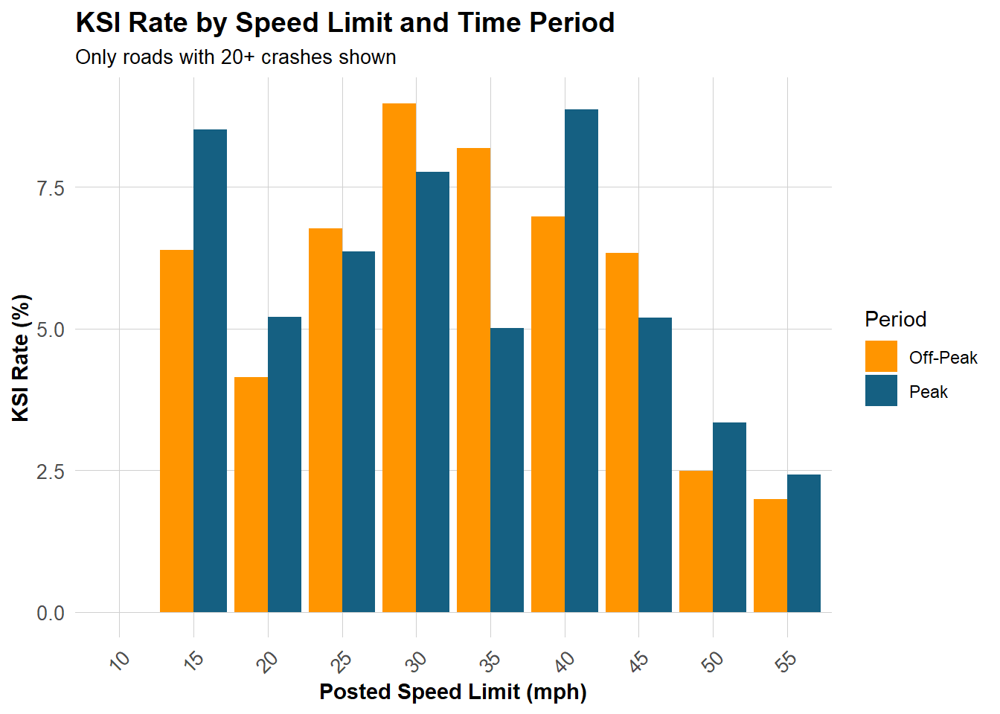

<style>
/* ---- Typography ---- */
body {
  font-family: "Lato", "Helvetica Neue", Helvetica, Arial, sans-serif;
  font-size: 15px;
  line-height: 1.7;
  color: #2c3e50;
}

h1.title {
  font-size: 36px;
  font-weight: 700;
  color: #156082;
  margin-bottom: 4px;
}

h3.subtitle {
  font-size: 20px;
  font-weight: 400;
  color: #555;
  margin-top: 0;
}

h1 { font-size: 30px; font-weight: 700; color: #156082; border-bottom: 2px solid #156082; padding-bottom: 6px; margin-top: 40px; }
h2 { font-size: 24px; font-weight: 600; color: #2c3e50; margin-top: 30px; }
h3 { font-size: 19px; font-weight: 600; color: #444; }
h4 { font-size: 16px; font-weight: 600; color: #555; }

/* ---- Accent colors ---- */
.accent-blue  { color: #156082; font-weight: 600; }
.accent-orange { color: #ff9500; font-weight: 600; }

/* ---- Callout boxes ---- */
.callout {
  padding: 14px 18px;
  margin: 20px 0;
  border-left: 5px solid #156082;
  background-color: #f0f6fa;
  border-radius: 0 6px 6px 0;
  font-style: italic;
  font-size: 15px;
  line-height: 1.6;
}

.callout-orange {
  border-left-color: #ff9500;
  background-color: #fff8ee;
}

.callout-finding {
  border-left-color: #27ae60;
  background-color: #f0faf4;
  font-style: normal;
}

/* ---- Stat highlight boxes ---- */
.stat-row {
  display: flex;
  gap: 16px;
  margin: 20px 0;
  flex-wrap: wrap;
}
.stat-box {
  flex: 1;
  min-width: 160px;
  background: #f7f9fc;
  border: 1px solid #dde3ea;
  border-radius: 8px;
  padding: 16px;
  text-align: center;
}
.stat-box .stat-num {
  font-size: 32px;
  font-weight: 700;
  color: #156082;
  display: block;
}
.stat-box .stat-num-orange {
  font-size: 32px;
  font-weight: 700;
  color: #ff9500;
  display: block;
}
.stat-box .stat-label {
  font-size: 12px;
  color: #777;
  margin-top: 4px;
  display: block;
}

/* ---- Tables ---- */
table {
  font-size: 13.5px;
}

/* ---- Misc ---- */
.note-to-reader {
  background: #fffbe6;
  border: 1px solid #ffe066;
  border-radius: 6px;
  padding: 12px 16px;
  font-size: 13.5px;
  margin-bottom: 24px;
}

hr { border-top: 1px solid #dde3ea; margin: 30px 0; }

img { border-radius: 4px; }

div.main-container { max-width: 1100px; }
</style>

```{r setup, include=FALSE}
knitr::opts_chunk$set(
  warning  = FALSE,
  message  = FALSE,
  echo     = TRUE,
  fig.align = "center"
)
```

```{r libraries, message=FALSE, warning=FALSE, class.source="fold-show"}
library(tidyverse)
library(tidylog)
library(janitor)
library(scales)
library(sf)
library(tidymodels)
library(knitr)
library(kableExtra)
library(patchwork)
library(DALEXtra)
library(pdp)
library(boxr)

# Box authentication (run once per session)
box_auth()
```


```{r libraries, message=FALSE, warning=FALSE, class.source="fold-show"}
# Project color palette — matched to maps and charts throughout
roadway_colors <- c("#ff9500", "#ffd000", "#00badb", "#156082")
names(roadway_colors) <- c("Major Arterial", "Minor Arterial", "Collector", "Local")

palette_orange <- "#ff9500"   # Major Arterial / highlight
palette_yellow <- "#ffd000"   # Minor Arterial
palette_cyan   <- "#00badb"   # Collector
palette_blue   <- "#156082"   # Local / primary headings

theme_set(theme_light(base_size = 12))
```

<div class="note-to-reader">
**A note to the reader:** This document presents the complete analysis pipeline for the MUSA 801 Practicum project on off-peak roadway safety, conducted in partnership with the City of Philadelphia's Office of Transportation and Infrastructure Systems (OTIS). Raw data are stored in a shared Box repository and loaded via the `boxr` API. Code chunks marked `eval=FALSE` contain the exact processing logic but are not re-executed here to avoid re-downloading large datasets. Pre-processed outputs are loaded directly from Box where needed.
</div>

---

# 1. Use Case

## 1.1 Background

Philadelphia's traffic fatality record has resisted improvement despite years of investment in safety infrastructure. Most interventions target peak-hour congestion — the hours when crashes are most numerous. Yet a quieter, more lethal phenomenon unfolds each night, when the same roads that efficiently move rush-hour traffic fall silent.

Wide arterials and multi-lane collectors, engineered to manage thousands of vehicles per hour, become something different after 10 PM: unobstructed corridors where a meaningful share of drivers travel well above posted limits. A crash at 50 mph on an empty road at 2 AM is not an anomaly — it is a structural outcome, predicted by the design of the road itself.

<div class="callout">
*"Congestion may contribute to fender benders, but excess capacity might be contributing to catastrophic outcomes."*
<br>— OTIS Project Brief
</div>

This phenomenon — the **off-peak safety paradox** — describes how the very road features that manage peak congestion (wide lanes, minimal friction, limited pedestrian crossings) create the physical conditions for dangerous speeds once traffic thins. High-speed collisions are far more likely to result in killed or serious injuries (KSI) than low-speed ones, and they occur precisely when roads are least monitored and least occupied.

The City of Philadelphia's Office of Transportation and Infrastructure Systems (OTIS), Office of Multimodal Planning, commissioned this study to shift from a reactive safety paradigm — responding to crash histories — toward a **predictive, planning-oriented** one. The goal: build a data system that can identify street segments likely to benefit from safety interventions *before* the next fatality occurs.

## 1.2 Study Area

The study covers **Philadelphia, Pennsylvania**, with a focus on 121 unique road segments equipped with speed measurement sensors distributed across arterial and collector streets citywide. These segments span a range of road types — from major arterials like Roosevelt Boulevard to neighborhood collectors — and carry speed monitoring data from 2022 to 2025.

Each segment is identified by a unique `seg_id` drawn from the Philadelphia Street Centerline dataset. All spatial analysis uses **EPSG:2272 (NAD83 / Pennsylvania South)** for foot-level precision.

```{r study-area-map, eval=FALSE}
# Load centerlines geometry
centerlines_geometry <- box_read_rds(2139915462983) %>%
  mutate(seg_id = as.character(seg_id)) %>%
  st_transform(crs = "EPSG:2272")

# Visualize monitored segment locations
ggplot(centerlines_geometry) +
  geom_sf(color = palette_orange, linewidth = 0.8) +
  labs(
    title   = "Speed-Monitored Road Segments — Philadelphia",
    subtitle = "121 segments with hourly speed and volume measurements",
    caption = "Source: OTIS / PennDOT speed data, Philadelphia Street Centerlines"
  ) +
  theme_void() +
  theme(
    plot.title    = element_text(size = 14, face = "bold", color = palette_blue),
    plot.subtitle = element_text(size = 11, color = "#555")
  )
```

## 1.3 Methodology Overview

Our methodology proceeds in three stages, each building on the last:

**Stage 1 — Establish the problem empirically.** Using five years of crash records (2020–2024), we quantify whether off-peak crashes are truly more lethal, and whether speeding-involved crashes concentrate outside peak hours. These analyses provide the empirical grounding for the modeling work.

**Stage 2 — Build a predictive model.** We train a Random Forest regression model to predict the percentage of vehicles speeding on a given segment during a given hour, as a function of structural road characteristics, temporal controls, and contextual features. The model achieves **R² = 0.892** on 10-fold cross-validation.

**Stage 3 — Support planning decisions.** The model enables counterfactual simulation: if this road were placed on a road diet (lanes reduced), or a separated bike lane added, how much would predicted speeding rates change? These outputs help planners prioritize investments where structural changes produce the largest safety gains.

---

# 2. Exploratory Data Analysis

## 2.1 Data Sources

All data were assembled from public open data portals, PennDOT administrative databases, and client-provided files stored in a shared Box repository.

```{r data-sources-table, echo=FALSE}
data_sources <- tribble(
  ~`#`, ~Dataset,                          ~Source,                          ~Owner,        ~`Role in Analysis`,
  "1",  "Crash Records (2020–2024)",        "PennDOT Statewide / OpenDataPhilly", "Kavana Raju",  "KSI validation; crash rates per segment",
  "2",  "Speed Data",                       "Philadelphia County Speed CSVs (Box)", "Chi-Hyun Kim", "**Primary modeling outcome** (% speeding)",
  "3",  "Volume Data",                      "PennDOT TIRE axle counts (Box)",  "Chi-Hyun Kim", "Traffic volume denominator",
  "4",  "Street Centerlines",               "OpenDataPhilly",                 "Demi Yang",   "Base network; seg_id join key",
  "5",  "RMS Admin Segments",               "GISDATA_RMSADMIN.shp (Box)",     "Demi Yang",   "Road geometry; surface width",
  "6",  "Complete Streets / DVRPC",         "DVRPC",                          "Demi Yang",   "Road typology, lanes, width",
  "7",  "Traffic Calming Devices",          "PennDOT Open Data / Box",        "Christine Cui","Speed humps, cushions — road diet proxy",
  "8",  "Intersection Controls",            "OpenDataPhilly",                 "Christine Cui","Stop signs, signals — node friction",
  "9",  "Streetlights / Street Poles",      "OpenDataPhilly",                 "Christine Cui","Nighttime visibility proxy",
  "10", "Bike Network",                     "OpenDataPhilly",                 "Demi Yang",   "Bike lane type — road diet indicator",
  "11", "Bus Stops / Transit",              "SEPTA",                          "Christine Cui","Pedestrian activity zones",
  "12", "Red Light Cameras",                "PPA / OpenDataPhilly",           "Christine Cui","Enforcement; driver behavior signal",
  "13", "PA TIP Projects",                  "DVRPC / PennDOT",               "Chi-Hyun Kim", "Planned/recent construction context",
  "14", "OpenStreetMap (OSM)",              "osmdata R package",             "Chi-Hyun Kim", "Supplemental road characteristics (pre-hand-check)",
  "15", "Land Parcels",                     "OpenDataPhilly",                 "—",           "Parcel density as land-use activity proxy"
)

data_sources %>%
  kbl(align = c("c", "l", "l", "l", "l"), escape = FALSE) %>%
  kable_classic(full_width = TRUE, html_font = "Lato") %>%
  kable_styling(font_size = 13) %>%
  row_spec(2, bold = TRUE, background = "#f0f6fa") %>%
  column_spec(1, bold = TRUE, width = "2em") %>%
  column_spec(2, width = "18em")
```

## 2.2 Crash Analysis (2020–2024)

### 2.2.1 Data Overview

```{r load-crash-data, eval=FALSE}
# Load and harmonize five years of PennDOT crash records
crash_years <- list(
  box_read_csv("2129578929490"),  # 2020
  box_read_csv("2129584283678"),  # 2021
  box_read_csv("2129572753523"),  # 2022
  box_read_csv("2129590204560"),  # 2023
  box_read_csv("2129573871742")   # 2024
)

# Harmonize schema differences across years
all_crashes <- crash_years %>%
  map(~ mutate(.x,
               WEATHER1    = as.character(WEATHER1),
               TCD_FUNC_CD = as.character(TCD_FUNC_CD))) %>%
  bind_rows() %>%
  filter(COUNTY == "67")    # Philadelphia only
```

```{r feature-engineering, eval=FALSE}
philly_crashes <- all_crashes %>%
  mutate(
    hour_raw        = str_sub(as.character(TIME_OF_DAY), 1, 2),
    HOUR_OF_DAY     = as.integer(hour_raw),
    HOUR_OF_DAY     = if_else(HOUR_OF_DAY == 99, NA_integer_, HOUR_OF_DAY),

    is_ksi          = if_else(FATAL_OR_SUSP_SERIOUS_INJ == "1", 1, 0, missing = 0),

    time_period     = case_when(
      HOUR_OF_DAY >= 7  & HOUR_OF_DAY < 10 ~ "AM Peak (7–10)",
      HOUR_OF_DAY >= 16 & HOUR_OF_DAY < 19 ~ "PM Peak (16–19)",
      HOUR_OF_DAY >= 10 & HOUR_OF_DAY < 16 ~ "Midday (10–16)",
      HOUR_OF_DAY >= 19 & HOUR_OF_DAY < 22 ~ "Evening (19–22)",
      HOUR_OF_DAY >= 22 | HOUR_OF_DAY < 7  ~ "Night/Late (22–7)",
      TRUE ~ "Unknown"
    ),

    is_peak         = if_else(
      time_period %in% c("AM Peak (7–10)", "PM Peak (16–19)"), 1, 0),
    is_weekend      = if_else(DAY_OF_WEEK %in% c(1, 7), 1, 0, missing = 0),
    SPEEDING_RELATED = as.integer(SPEEDING_RELATED)
  ) %>%
  mutate(
    time_period = factor(time_period, levels = c(
      "AM Peak (7–10)", "Midday (10–16)", "PM Peak (16–19)",
      "Evening (19–22)", "Night/Late (22–7)", "Unknown"))
  )
```

After filtering to Philadelphia (county code 67) and harmonizing schema differences across years, the combined dataset contains more than **16,000 crashes** with GPS coordinates, time stamps, severity indicators, and roadway context variables.

### 2.2.2 The Off-Peak Paradox: Fewer Crashes, More Deaths

This is the empirical heart of the project. When crash counts and KSI rates are plotted by hour of day, a striking inversion emerges:

```{r hourly-patterns, eval=FALSE}
hourly_summary <- philly_crashes %>%
  filter(!is.na(HOUR_OF_DAY)) %>%
  group_by(HOUR_OF_DAY) %>%
  summarise(
    total_crashes = n(),
    ksi_crashes   = sum(is_ksi),
    ksi_rate      = ksi_crashes / total_crashes * 100
  )

ggplot(hourly_summary, aes(x = HOUR_OF_DAY)) +
  geom_col(aes(y = total_crashes), fill = palette_blue, alpha = 0.7) +
  geom_line(aes(y = ksi_rate * 50), color = palette_orange,
            linewidth = 1.4) +
  geom_point(aes(y = ksi_rate * 50), color = palette_orange, size = 2.5) +
  scale_y_continuous(
    name     = "Total Crashes",
    sec.axis = sec_axis(~ . / 50, name = "KSI Rate (%)")
  ) +
  scale_x_continuous(breaks = 0:23) +
  labs(
    title    = "Hourly Crash Patterns in Philadelphia (2020–2024)",
    subtitle = "Crash volume (bars) vs. KSI rate (line) — the paradox made visible",
    x        = "Hour of Day",
    caption  = "Peak hours: 7–10 AM, 4–7 PM | KSI = Killed or Suspected Serious Injury"
  )
```

```{r hourly-patterns-img, echo=FALSE, out.width="100%"}
knitr::include_graphics(
  "exploratory_data_analysis/Crash_Data_Analysis_Clean_files/figure-html/hourly-patterns-1.png"
)
```

- **Peak hours (7–10 AM, 4–7 PM):** Crash volume is highest, but the KSI rate is lowest. Congestion keeps speeds down; most crashes are low-severity.
- **Night/Late hours (10 PM–7 AM):** Crash volume is lowest, but the KSI rate climbs steadily, peaking between 2–4 AM.

You are far more likely to be in a fender-bender at 5 PM than at 3 AM — but far more likely to be killed or seriously injured at 3 AM than at 5 PM.

### 2.2.3 Peak vs. Off-Peak: Statistical Test

```{r peak-offpeak, eval=FALSE}
peak_comparison <- philly_crashes %>%
  filter(!is.na(HOUR_OF_DAY)) %>%
  mutate(period_type = if_else(is_peak == 1, "Peak Hours", "Off-Peak Hours")) %>%
  group_by(period_type) %>%
  summarise(
    total_crashes  = n(),
    ksi_crashes    = sum(is_ksi),
    ksi_rate       = ksi_crashes / total_crashes * 100,
    speeding_rate  = sum(SPEEDING_RELATED, na.rm = TRUE) / total_crashes * 100
  )

# Chi-squared test for KSI rate difference
ksi_test <- prop.test(
  x = c(sum(philly_crashes$is_ksi[philly_crashes$is_peak == 0], na.rm = TRUE),
        sum(philly_crashes$is_ksi[philly_crashes$is_peak == 1], na.rm = TRUE)),
  n = c(sum(philly_crashes$is_peak == 0, na.rm = TRUE),
        sum(philly_crashes$is_peak == 1, na.rm = TRUE))
)
```

```{r peak-viz-img, echo=FALSE, out.width="70%", fig.cap="KSI rate is significantly higher during off-peak hours — a difference confirmed by chi-squared test (p < 0.05)."}
knitr::include_graphics(
  "exploratory_data_analysis/Crash_Data_Analysis_Clean_files/figure-html/peak-viz-1.png"
)
```

<div class="callout callout-finding">
A chi-squared proportion test confirms that the KSI rate difference between peak and off-peak hours is **statistically significant** (p < 0.05), consistent across all five years of data (2020–2024).
</div>

### 2.2.4 Speed Limit Interaction

```{r speed-interaction-img, echo=FALSE, out.width="90%", fig.cap="On roads with higher posted speed limits, the peak-vs-off-peak KSI rate gap widens — indicating that road design and low traffic interact to amplify danger."}

```

On roads with higher posted speed limits (35–45 mph), the gap in KSI rate between peak and off-peak hours widens further. The posted limit is not the binding constraint on speed during off-peak hours — **road design is**.

### 2.2.5 Spatial Distribution

```{r spatial-maps, echo=FALSE, fig.show='hold', out.width="50%", fig.cap="Left: All crashes by severity (2020–2024). Right: KSI-only crashes. High KSI-rate segments concentrate on wide arterials — not in the same locations as high crash-count segments."}
knitr::include_graphics(c(
  "exploratory_data_analysis/Crash_Data_Analysis_Clean_files/figure-html/map-all-crashes-1.png",
  "exploratory_data_analysis/Crash_Data_Analysis_Clean_files/figure-html/spatial-maps-1.png"
))
```

Two patterns stand out. **High crash-count segments** cluster around the dense grid of North and West Philadelphia arterials, correlating with volume. **High KSI-rate segments** do not overlap — they concentrate along wide, multi-lane arterials, particularly at the city's periphery where road design assumes higher speeds. This spatial divergence is itself a policy signal: crash history maps miss the most structurally dangerous corridors.

```{r road-crash-maps, echo=FALSE, fig.show='hold', out.width="50%", fig.cap="Left: Segments ranked by total crash count. Right: Segments ranked by KSI crash count. The two rankings diverge spatially — confirming that volume-based and severity-based risk require separate attention."}
knitr::include_graphics(c(
  "exploratory_data_analysis/Crash_Data_Analysis_Clean_files/figure-html/map-roads-by-crash-count-1.png",
  "exploratory_data_analysis/Crash_Data_Analysis_Clean_files/figure-html/map-roads-by-ksi-count-1.png"
))
```

## 2.3 Speed & Volume Data

### 2.3.1 Data Loading

Speed and volume data are provided as annual CSV files in a shared Box folder. They are read in batch using a helper function and joined with the `recordnum` key.

```{r read-speed-volume, eval=FALSE}
box_auth()
box_raw_data_folder       <- 362958311858
box_processed_data_folder <- 362958210990

# List files in the speed/volume folder
speed_volume_files <- box_ls(359822034820) %>% as_tibble()
speed_files  <- speed_volume_files %>% filter(str_detect(name, "Speed"))
volume_files <- speed_volume_files %>% filter(str_detect(name, "Volume"))

# Batch-read all CSVs from Box
batch_read_files <- function(data_files_info) {
  map2(data_files_info$id, data_files_info$name,
       ~ box_read_csv(.x) %>%
           mutate(across(where(is.character), ~ na_if(., "")),
                  source = .y, .before = everything())) %>%
    list_rbind()
}

speed_data_initial <- batch_read_files(speed_files) %>%
  clean_names() %>%
  mutate(year = as.numeric(str_extract(source, "\\d{4}")),
         countdate = mdy(countdate))

volume_data_initial <- batch_read_files(volume_files) %>%
  clean_names() %>%
  mutate(year = as.numeric(str_extract(source, "\\d{4}")),
         countdate = mdy(countdate))

# Load pre-processed speed data from Box (used in all analyses below)
speed <- box_read_rds(2171353657698) %>%
  mutate(seg_id = as.character(seg_id),
         speed_measurement_hour = str_pad(as.character(speed_measurement_hour),
                                          width = 2, side = "left", pad = "0"),
         speed_measurement_month = str_pad(as.character(speed_measurement_month),
                                           width = 2, side = "left", pad = "0"))
```

### 2.3.2 Data Structure

Speed data are collected via pneumatic tube counters, providing **hourly vehicle counts broken down into 5 mph speed bins** for each measurement location and year. Key fields:

- `recordnum`: unique measurement session identifier — the most reliable row-level key (no duplicates at hour 0)
- `countdate`, `count_hr`: date and hour of measurement (0–23)
- Speed bin columns: vehicle counts per 5 mph increment (e.g., `speed_0_5`, `speed_5_10`, ...)
- `trafdir`: traffic direction (`both`, `east`, `north`, etc.)
- `aadv`: annual average daily volume; `speedlimit`: posted speed limit

**Key identifier finding:** `recordnum` is the cleanest unique row identifier. Lat/lon coordinates have minor duplication issues at some locations (multiple tubes measuring the same road section), so `recordnum` is used throughout as the primary key.

**Speed–volume join:** `recordnum` is also the join key between speed and volume datasets. About 15% of rows show minor volume disagreements between the two files; the volume dataset value takes priority since it is purpose-built for volume measurement.

### 2.3.3 Data Preparation: Long Format & Speeding Categories

```{r speed-long-format, eval=FALSE}
speed_data_long <- speed_data_initial %>%
  left_join(volume_data_initial %>%
              select(recordnum, countdate, count_hr, volcount),
            by = c("recordnum", "countdate", "count_hr")) %>%
  mutate(volume_total = case_when(
    is.na(volcount)              ~ total,
    volcount == 0 & total != 0   ~ total,
    total > volcount             ~ total,
    .default = volcount)) %>%
  select(year, recordnum, speedlimit, road, fromlmt, tolmt,
         countdate, count_hr, volume_total, contains("speed_")) %>%
  pivot_longer(contains("speed_"),
               values_to = "count",
               names_to  = c("range_low", "range_high"),
               names_pattern = "speed_(\\d+)_(\\d+)") %>%
  mutate(range_low  = as.numeric(range_low),
         range_high = as.numeric(range_high)) %>%
  # Binary: speeding / not speeding
  mutate(speed_category_binary =
           if_else(range_high > speedlimit, "Speeding", "Not speeding")) %>%
  # Detailed: how far over the limit
  mutate(speed_category_detailed = case_when(
    range_high <= speedlimit             ~ "Not speeding",
    range_low  > speedlimit + 20         ~ "More than 20mph over",
    range_low  > speedlimit + 15         ~ "16–20mph over",
    range_low  > speedlimit + 10         ~ "11–15mph over",
    range_low  > speedlimit +  0         ~ "1–10mph over",
    .default = "CHECK")) %>%
  mutate(speed_category_detailed = fct_relevel(
    speed_category_detailed,
    "Not speeding", "1–10mph over", "11–15mph over",
    "16–20mph over", "More than 20mph over")) %>%
  # Time of day
  mutate(time_of_day = case_when(
    count_hr >= 20 ~ "Off-peak",
    count_hr >= 16 ~ "Peak",
    count_hr >= 11 ~ "Off-peak",
    count_hr >=  7 ~ "Peak",
    count_hr >=  0 ~ "Off-peak")) %>%
  mutate(period_of_day = case_when(
    count_hr >= 20 ~ "Off-peak (night)",
    count_hr >= 16 ~ "Peak (evening)",
    count_hr >= 11 ~ "Off-peak (midday)",
    count_hr >=  7 ~ "Peak (morning)",
    count_hr >=  0 ~ "Off-peak (night)")) %>%
  mutate(period_of_day = fct_relevel(
    period_of_day,
    "Off-peak (night)", "Off-peak (midday)",
    "Peak (evening)",   "Peak (morning)"))
```

### 2.3.4 Data Coverage

```{r coverage-table, echo=FALSE}
coverage <- tribble(
  ~Year, ~`Speed Records`, ~`Volume Records`, ~`Share`,
  "2022", "~25,776", "~25,248", "46.5%",
  "2023", "~14,712", "~14,736", "26.5%",
  "2025", "~8,592",  "~8,256",  "15.5%",
  "2024", "~6,408",  "~6,432",  "11.5%"
)

coverage %>%
  kbl(align = "c") %>%
  kable_classic(full_width = FALSE, html_font = "Lato") %>%
  kable_styling(font_size = 13) %>%
  row_spec(1, bold = TRUE, background = "#f0f6fa") %>%
  add_footnote("Speed and volume record counts are nearly identical within each year, confirming strong dataset alignment.",
               notation = "none")
```

2022 dominates at ~46% of all hourly records. **Measurement dates vary systematically from year to year** — including months covered, weekday/weekend share, and hourly completeness. Coverage through the hours of the day is even (one row per hour per measurement session).

```{r temporal-coverage, eval=FALSE}
# Temporal coverage: measurement instances by date and year
speed_data_temporal <- speed_data_initial %>%
  group_by(year, countdate) %>%
  summarise(instances = n_distinct(aadv), .groups = "drop") %>%
  mutate(weekday = wday(countdate, label = TRUE),
         weekend = if_else(weekday %in% c("Sat", "Sun"), "Weekend", "Weekday"),
         month   = month(countdate, label = TRUE))

# Monthly breakdown with weekday/weekend split
speed_data_temporal %>%
  group_by(year, month, weekend) %>%
  summarise(instances = sum(instances), .groups = "drop") %>%
  ggplot(aes(x = month, y = instances, fill = weekend)) +
  geom_col(position = position_stack()) +
  scale_fill_manual(values = c(Weekday = palette_blue, Weekend = palette_cyan)) +
  facet_wrap(~ year, ncol = 2) +
  labs(title    = "Measurement instances by month and weekday/weekend status",
       subtitle = "Temporal distribution varies substantially across years",
       x = NULL, y = "Measurement instances", fill = NULL)
```

### 2.3.5 Spatial Coverage & Roadway Types

Joining speed measurement coordinates to Philadelphia street centerlines spatially (nearest-feature snap), we classify each measurement point by roadway type.

```{r centerlines-join, eval=FALSE}
# Load centerlines from Box
centerlines <- box_read_rds(2139915462983) %>%
  mutate(roadway_type = case_when(
    class == 2  ~ "Major Arterial",
    class == 3  ~ "Minor Arterial",
    class == 4  ~ "Collector",
    class == 5  ~ "Local",
    class == 9  ~ "Low Speed Ramps",
    class == 10 ~ "High Speed Ramps",
    class == 1  ~ "Expressways",
    TRUE        ~ NA_character_)) %>%
  filter(!is.na(roadway_type)) %>%
  select(seg_id, roadway_type) %>%
  mutate(centerlines_index = row_number()) %>%
  st_transform("EPSG:2272")

# Snap speed measurement points to nearest centerline
speed_data_coords <- speed_data_initial %>%
  distinct(recordnum, longitude, latitude) %>%
  st_as_sf(coords = c("longitude", "latitude"), crs = "EPSG:4326") %>%
  st_transform("EPSG:2272")

nearest_idx <- st_nearest_feature(speed_data_coords, centerlines)
speed_data_centerlines <- speed_data_coords %>%
  mutate(centerlines_index = centerlines$centerlines_index[nearest_idx]) %>%
  left_join(centerlines %>% st_drop_geometry(), by = "centerlines_index")

# Map monitored segments by roadway type
mapview(speed_data_centerlines %>%
          filter(!roadway_type %in% c("High Speed Ramps","Low Speed Ramps","Expressways")) %>%
          mutate(roadway_type = fct_relevel(roadway_type,
            "Major Arterial","Minor Arterial","Collector","Local")),
        zcol       = "roadway_type",
        color      = roadway_colors,
        lwd        = 4,
        layer.name = "Roadway type")
```

Highway and ramp measurement points are **excluded from all analyses** below. The distribution of remaining measurement points by roadway type is:

```{r roadway-type-table, echo=FALSE}
tribble(
  ~`Roadway Type`,   ~N,    ~Percent,
  "Major Arterial",  "230", "41.97%",
  "Minor Arterial",  "166", "30.29%",
  "Collector",       "132", "24.09%",
  "Local",           " 20", " 3.65%"
) %>%
  kbl(align = c("l","r","r")) %>%
  kable_classic(full_width = FALSE, html_font = "Lato") %>%
  kable_styling(font_size = 13) %>%
  row_spec(1, background = "#fff3e0") %>%
  row_spec(2, background = "#fffde7") %>%
  row_spec(3, background = "#e0f7fa") %>%
  row_spec(4, background = "#e3f0f8")
```

### 2.3.6 Speeding by Time of Day

#### Binary: Speeding vs. Not Speeding

```{r speeding-by-hour-binary, eval=FALSE}
speed_data_analysis %>%
  group_by(recordnum, countdate, count_hr, time_of_day, speed_category_binary) %>%
  summarise(count = sum(count), .groups = "drop") %>%
  group_by(count_hr, time_of_day, speed_category_binary) %>%
  summarise(count = sum(count), .groups = "drop") %>%
  mutate(percent = count / sum(count)) %>%
  filter(speed_category_binary == "Speeding") %>%
  ggplot(aes(x = count_hr, y = percent, fill = time_of_day)) +
  geom_col() +
  scale_y_continuous(labels = label_percent()) +
  scale_fill_manual(values = c("Peak" = palette_blue, "Off-peak" = palette_orange)) +
  labs(title    = "Share of traffic speeding by hour of day",
       subtitle = "Off-peak hours show consistently higher speeding rates",
       x = "Hour", y = "% of traffic speeding", fill = "Period")
```

#### Detailed: By Severity of Speeding

```{r speeding-by-hour-detailed, eval=FALSE}
speed_data_analysis %>%
  group_by(recordnum, countdate, count_hr, speed_category_detailed) %>%
  summarise(count = sum(count), .groups = "drop") %>%
  group_by(count_hr, speed_category_detailed) %>%
  summarise(count = sum(count), .groups = "drop") %>%
  group_by(count_hr) %>%
  mutate(percent = count / sum(count)) %>%
  filter(speed_category_detailed != "Not speeding") %>%
  ggplot(aes(x = count_hr, y = percent, fill = speed_category_detailed)) +
  geom_col(position = position_stack()) +
  scale_y_continuous(labels = label_percent()) +
  scale_fill_manual(values = c(
    "1–10mph over"        = palette_yellow,
    "11–15mph over"       = palette_orange,
    "16–20mph over"       = "#e05000",
    "More than 20mph over"= "#8b0000")) +
  labs(title    = "Speeding severity by hour of day",
       subtitle = "High-severity speeding (>10mph over) peaks sharply at night",
       x = "Hour", y = "% of all traffic", fill = "Speed over limit")
```

#### By Roadway Type

```{r speeding-by-roadtype, eval=FALSE}
speed_data_analysis %>%
  filter(!is.na(roadway_type)) %>%
  group_by(roadway_type, count_hr, speed_category_binary) %>%
  summarise(count = sum(count), .groups = "drop") %>%
  group_by(roadway_type, count_hr) %>%
  mutate(percent = count / sum(count)) %>%
  filter(speed_category_binary == "Speeding") %>%
  ggplot(aes(x = count_hr, y = percent, color = roadway_type)) +
  geom_line(linewidth = 1.1) +
  scale_y_continuous(labels = label_percent()) +
  scale_color_manual(values = roadway_colors) +
  facet_wrap(~ roadway_type, ncol = 2) +
  labs(title  = "Speeding rate by hour of day and roadway type",
       x = "Hour", y = "% of traffic speeding", color = NULL) +
  theme(legend.position = "none")
```

### 2.3.7 Off-Peak Speed Corridors

Where are the roadways with the highest off-peak speeding rates? We identify two groups of high-risk segments.

**Any speeding (> 50% of traffic speeding in off-peak hours):**

```{r offpeak-corridors, echo=FALSE}
offpeak_any <- tribble(
  ~`Roadway Type`,  ~N,   ~`% of all segments that type`,
  "Major Arterial", "76 (54.68% of high-risk)",  "33.04%",
  "Minor Arterial", "37 (26.62%)",               "22.29%",
  "Collector",      "24 (17.27%)",               "18.18%",
  "Local",          " 2 ( 1.44%)",               "10.00%"
)
offpeak_any %>%
  kbl(align = c("l","r","r")) %>%
  kable_classic(full_width = FALSE, html_font = "Lato") %>%
  kable_styling(font_size = 13) %>%
  row_spec(1, bold = TRUE, background = "#fff3e0")
```

**High speeding (> 10% of traffic exceeding speed limit by 11+ mph in off-peak hours):**

```{r offpeak-high, echo=FALSE}
offpeak_high <- tribble(
  ~`Roadway Type`,  ~N,   ~`% of all segments that type`,
  "Major Arterial", "53 (66.25% of high-risk)",  "23.04%",
  "Minor Arterial", "19 (23.75%)",               "11.45%",
  "Collector",      " 6 ( 7.50%)",               " 4.55%",
  "Local",          " 2 ( 2.50%)",               "10.00%"
)
offpeak_high %>%
  kbl(align = c("l","r","r")) %>%
  kable_classic(full_width = FALSE, html_font = "Lato") %>%
  kable_styling(font_size = 13) %>%
  row_spec(1, bold = TRUE, background = "#fff3e0")
```

<div class="callout callout-orange">
Major arterials are disproportionately represented in both groups. **One in three Major Arterials** in the monitoring network has more than half of its off-peak traffic exceeding the speed limit. For high-severity speeding (11+ mph over), the concentration on Major Arterials is even more pronounced — 23% of Major Arterials meet this threshold versus only 4.5% of Collectors.
</div>

```{r offpeak-map, eval=FALSE}
# Map high-risk off-peak segments
high_risk_segments <- speed_data_analysis %>%
  filter(time_of_day == "Off-peak") %>%
  group_by(recordnum, seg_id, roadway_type, speed_category_binary) %>%
  summarise(count = sum(count), .groups = "drop") %>%
  group_by(recordnum, seg_id, roadway_type) %>%
  mutate(percent = count / sum(count)) %>%
  filter(speed_category_binary == "Speeding",
         percent > 0.5)

mapview(high_risk_segments %>%
          left_join(centerlines %>% select(seg_id), by = "seg_id") %>%
          st_as_sf(crs = "EPSG:2272"),
        zcol       = "roadway_type",
        color      = roadway_colors,
        lwd        = 4,
        layer.name = "High off-peak speeding segments")
```

### 2.3.8 Volume–Speeding Relationship

Does lower traffic volume in a given hour lead to higher speeding? The data show **no definitive pattern** — neither for any speeding nor for high speeding. This suggests that volume alone does not drive off-peak speeding; rather, the structural road characteristics (the focus of this project) are the dominant predictors.

```{r volume-speeding, eval=FALSE}
speed_data_analysis %>%
  filter(!is.na(roadway_type)) %>%
  group_by(recordnum, countdate, count_hr, roadway_type,
           time_of_day, speed_category_binary, volume_total) %>%
  summarise(count = sum(count), .groups = "drop") %>%
  group_by(recordnum, countdate, count_hr, roadway_type, time_of_day, volume_total) %>%
  mutate(percent = count / sum(count)) %>%
  filter(speed_category_binary == "Speeding") %>%
  ggplot(aes(x = volume_total, y = percent, color = roadway_type)) +
  geom_point(alpha = 0.2, size = 0.8) +
  geom_smooth(method = "lm", se = FALSE, linewidth = 1.1) +
  scale_y_continuous(labels = label_percent()) +
  scale_color_manual(values = roadway_colors) +
  scale_x_log10() +
  facet_wrap(~ time_of_day, ncol = 2) +
  labs(title  = "Volume vs. speeding rate by roadway type and time of day",
       x = "Total volume (log scale)", y = "% traffic speeding",
       color = "Roadway type") +
  theme(legend.position = "bottom")
```

### 2.3.9 Modeling Outcome Construction

From the long-format speed data, we aggregate to two modeling output formats used downstream.

```{r construct-modeling-outputs, eval=FALSE}
# By hour (primary modeling unit)
speed_summary_all <- speed_data_analysis %>%
  group_by(recordnum, countdate, count_hr, speeding = speed_category_binary, volume_total) %>%
  summarise(all_speeding_count = sum(count), .groups = "drop") %>%
  filter(speeding == "Speeding") %>%
  mutate(all_speeding_percent = all_speeding_count / volume_total)

speed_modeling_data_by_hour <- speed_data_analysis %>%
  distinct(recordnum, seg_id, countdate, count_hr,
           road, longitude, latitude, speedlimit, volume_total) %>%
  left_join(speed_summary_all %>%
              select(recordnum, countdate, count_hr,
                     all_speeding_count, all_speeding_percent),
            by = c("recordnum", "countdate", "count_hr")) %>%
  mutate(
    speed_measurement_month       = month(countdate),
    speed_measurement_day_of_week = if_else(
      wday(countdate, label = TRUE) %in% c("Sat","Sun"), "Weekend", "Weekday")
  ) %>%
  rename(speed_measurement_road      = road,
         speed_measurement_date      = countdate,
         speed_measurement_hour      = count_hr,
         speed_limit                 = speedlimit)

# Save to Box (commented out after first run)
# box_save_rds(speed_modeling_data_by_hour,
#              file_name = "speed_modeling_data_by_hour_v1.rds",
#              dir_id    = box_processed_data_folder)
```

## 2.4 Case Studies: Off-Peak Safety Interventions

To contextualize Philadelphia's situation, we examined comparable cities where structural road interventions specifically targeted off-peak speeding. These case studies informed the design of our policy simulation scenarios.

### 2.4.1 New York City — Queens Boulevard Road Diet

Once nicknamed the *"Boulevard of Death,"* Queens Boulevard saw pedestrian fatalities drop from 70+ per year to near zero after a sustained road diet reduced lanes, narrowed travel lanes, and added protected pedestrian islands. The intervention explicitly targeted the off-peak speeding that made the wide roadway deadly at night and on weekends.

### 2.4.2 Oslo, Norway — Vision Zero Network

Oslo achieved zero traffic fatalities in 2019, partly through systematic lane reductions on multi-lane urban roads and city-wide traffic calming deployment. The city found that road diet measures were most effective on roads where off-peak volumes were lowest relative to design capacity — precisely the conditions we are modeling here.

### 2.4.3 Chicago — Protected Bike Lane Corridors

Research on Chicago's protected bike lane corridors found that physical lane separation independently reduced motor vehicle speeding rates — even during late-night hours with minimal cyclist presence. The infrastructure itself, not the presence of cyclists, provided the speed-reducing effect. This directly supports our use of `bike_lane_status` as a structural predictor.

---

# 3. Data Wrangling & Spatial Joins

## 3.1 Network Construction

The base network uses Philadelphia's official Street Centerline file, with each segment identified by `seg_id`. Road characteristics were compiled from three sources and merged in priority order:

1. **RMS Admin data** (highest priority): surface width (`surfawidth`), segment geometry
2. **DVRPC Complete Streets**: road typology, lane counts (`NEW_LANES`), roadway width (`NEW_WID`), divided roadway indicator (`DIV_RDWY`)
3. **Hand-checked data**: for segments with conflicting or missing values, all four team members manually reviewed characteristics via Google Street View

```{r build-network, eval=FALSE}
network_main <- box_read_rds(2151757279199) %>%
  as_tibble() %>%
  rename(
    width_dvrpc          = NEW_WID,
    lanes_dvrpc          = NEW_LANES,
    arterial_type_dvrpc  = TYPOLOGY__,
    divided_roadway      = DIV_RDWY,
    road_classification_city = class1_cs,
    road_classification_fhwa = fhwa_func_desc
  ) %>%
  mutate(width_rms = na_if(surfawidth, 0)) %>%
  # Priority: RMS width first, then DVRPC
  mutate(width = coalesce(width_rms, width_dvrpc)) %>%
  # Manual corrections for known anomalies (from data_check)
  mutate(width = case_when(
    seg_id == "340834" ~ 75,
    seg_id == "340836" ~ 72,
    seg_id == "221117" ~ 93,
    seg_id == "421398" ~ 80,
    .default = width
  )) %>%
  mutate(divided_roadway = case_when(
    divided_roadway == 1 ~ TRUE,
    divided_roadway == 0 ~ FALSE
  ))
```

## 3.2 Spatial Join Strategy

Joining point-based urban facility datasets to the line network requires different strategies depending on the physical distribution of each feature type.

### 3.2.1 Strategy A — Edge-Based Features (Nearest Neighbor)

For features distributed along road segments (transit stops, street poles, traffic calming devices), each point is snapped to its nearest centerline using `st_nearest_feature`.

```{r strategy-a, eval=FALSE}
count_nearest_points <- function(points_sf, lines_sf, id_col, new_count_name) {
  points_only_geom <- points_sf %>% select(geometry)
  lines_only_id    <- lines_sf  %>% select(all_of(id_col))

  points_joined <- st_join(points_only_geom, lines_only_id,
                           join = st_nearest_feature)

  points_joined %>%
    st_drop_geometry() %>%
    filter(!is.na(!!sym(id_col))) %>%
    group_by(!!sym(id_col)) %>%
    summarise(!!new_count_name := n(), .groups = "drop")
}

poles_count   <- count_nearest_points(street_poles,    basenetwork, "seg_id", "count_poles")
bus_count     <- count_nearest_points(transit_stops,   basenetwork, "seg_id", "count_transit")
calming_count <- count_nearest_points(traffic_calming, basenetwork, "seg_id", "count_calming")
```

### 3.2.2 Strategy B — Node-Based Features (30-foot Buffer)

For features located at intersections (red light cameras, intersection controls), a **30-foot buffer** is applied around each point before intersecting with the centerline network. This ensures that all 3–4 converging segments at an intersection are captured.

The choice of 30 feet is deliberate: standard urban street right-of-way is 40–60 feet. A 30-foot radius from a corner correctly bridges the gap between the physical installation location and the network topology, without bleeding into adjacent blocks.

```{r strategy-b, eval=FALSE}
count_intersection_points <- function(points_sf, lines_sf, id_col,
                                      new_count_name, buffer_ft = 30) {
  points_buffered <- st_buffer(points_sf, dist = buffer_ft)
  lines_joined    <- st_join(lines_sf, points_buffered, join = st_intersects)

  lines_joined %>%
    st_drop_geometry() %>%
    group_by(!!sym(id_col)) %>%
    summarise(!!new_count_name := n(), .groups = "drop")
}

intersect_count <- count_intersection_points(
  intersection_ctrl, basenetwork, "seg_id", "count_intersection_ctrl")
camera_count    <- count_intersection_points(
  fixed_camera,      basenetwork, "seg_id", "count_camera")
```

The final supplementary network table provides per-segment counts of: `count_poles`, `count_transit`, `count_calming`, `count_intersection_ctrl`, `count_camera`.

## 3.3 Crash-to-Network Linkage

Linking 16,000+ crash records to the street network uses a two-tier approach.

**Tier 1 — Street Name Match (High Confidence).** Each crash record's cleaned street name is matched against the network street name lookup. This tier achieves the highest match rates with the highest confidence.

**Tier 2 — Spatial Snap within 100 feet (Fallback).** For unmatched crashes with valid GPS coordinates, each point is snapped to its nearest centerline within 100 feet. Confidence is scaled by distance: ≤50 ft = High, ≤75 ft = Medium, >75 ft = Low.

```{r crash-linkage, eval=FALSE}
# Tier 1: Street name matching
crashes_street_matched <- philly_crashes %>%
  filter(!is.na(crash_street_clean)) %>%
  inner_join(street_lookup %>%
               group_by(full_street_name_clean) %>%
               slice(1) %>% ungroup(),
             by = c("crash_street_clean" = "full_street_name_clean")) %>%
  mutate(road_source       = "Street_Name",
         match_confidence  = "High")

# Tier 2: Spatial snap (for unmatched crashes with coordinates)
crashes_needing_snap <- philly_crashes %>%
  filter(!(CRN %in% crashes_street_matched$CRN), has_valid_coords) %>%
  st_as_sf(coords = c("DEC_LONGITUDE", "DEC_LATITUDE"), crs = 4326) %>%
  st_transform(crs = 2272)

crashes_snapped <- crashes_needing_snap %>%
  mutate(
    nearest_road_id = st_nearest_feature(geometry, street_roads),
    snap_distance   = as.numeric(
      st_distance(geometry, street_roads[nearest_road_id,], by_element = TRUE))
  ) %>%
  filter(snap_distance <= 100) %>%
  mutate(match_confidence = case_when(
    snap_distance <= 50 ~ "High",
    snap_distance <= 75 ~ "Medium",
    TRUE               ~ "Low"
  ))
```

Only **High-confidence** matches are used for segment-level crash aggregation in the modeling pipeline.

## 3.4 Data Quality Checks

The 472 unique road segments covered by speed monitoring data were divided among team members for manual quality review using Google Street View and interactive KML maps exported via `mapview`.

```{r data-check-table, echo=FALSE}
tribble(
  ~`Team Member`,  ~Segments, ~`Variables Checked`,
  "Christine Cui", "112",     "lanes, divided_roadway, parking, sidewalk_status",
  "Demi Yang",     "112",     "lanes, divided_roadway, bike_lane_type, parking",
  "Kavana Raju",   "112",     "lanes, divided_roadway, bike_lane_type, sidewalk_status",
  "Chi-Hyun Kim",  "136",     "lanes, divided_roadway, bike_lane_type, parking"
) %>%
  kbl(align = c("l","c","l")) %>%
  kable_classic(full_width = TRUE, html_font = "Lato") %>%
  kable_styling(font_size = 13)
```

Hand-checked values were applied via `coalesce()` priority: verified values override automated values where available. This ensures that the 472 monitored segments — the foundation of the model — have the most accurate road characteristic data possible.

---

# 4. Modeling

## 4.1 Outcome Variable

The modeling outcome is **`all_speeding_percent`**: the proportion of vehicles on a given segment in a given hour that exceeded the posted speed limit. This continuous variable in the [0, 1] range was chosen over crash counts for three reasons:

1. **Statistical tractability:** A continuous proportion is far more amenable to regression modeling than crash counts, which are rare, overdispersed, and stochastic at the segment level.
2. **Theoretical link to KSI:** Speeding is the strongest direct driver of KSI crash outcomes — reducing speeding rates is the mechanism by which road design changes save lives.
3. **Policy relevance:** Speeding rates are *changeable* through design interventions; historical crash records are not.

After removing rows with missing outcome values, the modeling dataset contains **54,132 hourly segment-observations**.

```{r prep-modeling-data, eval=FALSE}
modeling_data <- speed %>%
  filter(!is.na(all_speeding_percent) & !is.na(high_speeding_percent)) %>%
  mutate(year = year(speed_measurement_date)) %>%
  select(seg_id, all_speeding_percent, volume_total,
         speed_measurement_road, year,
         speed_measurement_month, speed_measurement_day_of_week,
         speed_measurement_hour, speed_limit, traffic_direction) %>%
  left_join(data_checked %>%
              select(seg_id, lanes, divided_roadway, parking, sidewalk_status),
            by = "seg_id") %>%
  mutate(lanes = as.factor(lanes)) %>%
  left_join(crashes %>%
              select(seg_id, total_crashes, ksi_rate,
                     crash_speed_involvement_rate), by = "seg_id") %>%
  left_join(network_main %>%
              select(seg_id, length, width,
                     arterial_type_dvrpc,
                     road_classification_city,
                     road_classification_fhwa), by = "seg_id") %>%
  left_join(network_supplementary %>%
              select(seg_id, count_transit, traffic_calming,
                     count_intersection_ctrl), by = "seg_id") %>%
  left_join(network_bike %>%
              select(seg_id, year, bike_lane_status),
            by = c("seg_id", "year")) %>%
  mutate(bike_lane_status = replace_na(bike_lane_status, "None")) %>%
  left_join(network_parcels %>% select(seg_id, parcel_density),
            by = "seg_id") %>%
  mutate(parcel_density = replace_na(parcel_density, 0)) %>%
  select(-year)
```

## 4.2 Feature List

The modeling dataset was assembled from five component tables joined on `seg_id` (and `year` for time-varying features). The complete feature set is:

```{r feature-table, echo=FALSE}
features <- tribble(
  ~Category,              ~Feature,                      ~Type,         ~Description,
  "Temporal",             "speed_measurement_hour",      "Categorical", "Hour of measurement (0–23) — treated as factor, not continuous",
  "Temporal",             "speed_measurement_month",     "Categorical", "Month — captures seasonal variation",
  "Temporal",             "speed_measurement_day_of_week","Categorical","Day of week",
  "Road Structure",       "lanes",                       "Factor",      "Number of lanes — treated as category, not a continuous number",
  "Road Structure",       "speed_limit",                 "Continuous",  "Posted speed limit (mph)",
  "Road Structure",       "width",                       "Continuous",  "Roadway width (ft); RMS-first, DVRPC fallback, manual corrections applied",
  "Road Structure",       "length",                      "Continuous",  "Segment length",
  "Road Structure",       "divided_roadway",             "Boolean",     "Physical median divider present",
  "Road Structure",       "traffic_direction",           "Categorical", "One way vs. Both directions",
  "Road Structure",       "road_classification_city",    "Categorical", "Major / Minor Arterial / Collector / Local Residential",
  "Road Structure",       "road_classification_fhwa",    "Categorical", "Federal Functional Classification",
  "Intervention/Context", "bike_lane_status",            "Categorical", "None / Sharrow / Painted / Separated",
  "Intervention/Context", "traffic_calming",             "Boolean",     "Any traffic calming device present on segment",
  "Intervention/Context", "parking",                     "Categorical", "On-street parking present",
  "Intervention/Context", "sidewalk_status",             "Categorical", "Sidewalk presence and condition",
  "Intervention/Context", "count_transit",               "Continuous",  "Number of transit stops on segment",
  "Intervention/Context", "count_intersection_ctrl",     "Continuous",  "Number of intersection control devices",
  "Intervention/Context", "parcel_density",              "Continuous",  "Adjacent parcel density — land-use activity proxy",
  "Fixed Effect",         "speed_measurement_road",      "Categorical", "Road name — absorbs unmeasured corridor-level characteristics",
  "Volume",               "volume_total",                "Continuous",  "Total vehicles observed in the measurement hour",
  "Crash Context",        "total_crashes",               "Continuous",  "Total crashes on segment (2020–2024)",
  "Crash Context",        "ksi_rate",                    "Continuous",  "Proportion of crashes that were KSI",
  "Crash Context",        "crash_speed_involvement_rate","Continuous",  "Proportion of crashes with speed involvement"
)

features %>%
  kbl(align = c("l","l","l","l")) %>%
  kable_classic(full_width = TRUE, html_font = "Lato") %>%
  kable_styling(font_size = 13) %>%
  pack_rows("Temporal", 1, 3) %>%
  pack_rows("Road Structure", 4, 11) %>%
  pack_rows("Intervention / Context", 12, 18) %>%
  pack_rows("Fixed Effect", 19, 19) %>%
  pack_rows("Volume", 20, 20) %>%
  pack_rows("Crash Context", 21, 23) %>%
  column_spec(4, width = "32em")
```

## 4.3 Feature Engineering

**Bike lane reclassification.** Raw bike lane types were consolidated into four categories for modeling stability:

```{r bike-reclassification, eval=FALSE}
network_bike <- box_read_rds(2178022998565) %>%
  mutate(bike_lane_type_simple = case_when(
    bike_lane_type %in% c("Advisory Bike Lane", "Sharrow")                               ~ "Sharrow",
    bike_lane_type %in% c("Bus/Bike Lane", "Painted Bike Lane")                          ~ "Painted",
    bike_lane_type %in% c("On-Street Separated Bike Lane",
                          "Raised Separated Bike Lane",
                          "Shared Use Sidepath")                                          ~ "Separated",
    bike_lane_type %in% c("None", "Unknown") | is.na(bike_lane_type)                     ~ "None",
    .default = "CHECK"
  )) %>%
  # Apply hand-checked corrections
  full_join(data_checked %>%
              select(seg_id, year,
                     bike_lane_type_checked = bike_lane_type_simple),
            by = c("seg_id", "year")) %>%
  mutate(bike_lane_status = coalesce(bike_lane_type_checked,
                                     bike_lane_type_simple)) %>%
  filter(bike_lane_status != "None")
```

**Lanes as a factor.** `lanes` is explicitly treated as a categorical factor, not a continuous number. The relationship between lane count and speeding is not linear — design standards, driver behavior, and road feel shift categorically at certain thresholds. Treating lanes as continuous would impose a linear constraint that the data do not support.

## 4.4 Model Architecture

```{r model-spec, eval=FALSE}
# Random Forest specification
rf_spec <-
  rand_forest() %>%
  set_engine("ranger", importance = "impurity") %>%
  set_mode("regression")

# Two recipe specifications for comparison
recipe_0 <- recipe(modeling_train) %>%
  update_role(all_speeding_percent, new_role = "outcome")

# Minimal recipe: hour, lanes, road classification, volume
recipe_minimal_rf_city <- recipe_0 %>%
  update_role(speed_measurement_hour, lanes,
              road_classification_city, volume_total,
              new_role = "predictor")

# Main recipe: all features
recipe_main_rf_city <- recipe_0 %>%
  update_role(
    speed_measurement_hour, lanes, road_classification_city,
    divided_roadway, traffic_direction, speed_measurement_road,
    speed_measurement_month, speed_measurement_day_of_week,
    speed_limit, volume_total, sidewalk_status, parking,
    bike_lane_status, parcel_density, count_transit, traffic_calming,
    count_intersection_ctrl, length, width, total_crashes, ksi_rate,
    new_role = "predictor"
  )

# Combine into workflow set
models <- workflow_set(
  preproc = list(minimal_city = recipe_minimal_rf_city,
                 main_city    = recipe_main_rf_city),
  models  = list(rf_spec),
  cross   = TRUE
)

# 10-fold cross-validation
set.seed(2718)
data_folds      <- vfold_cv(modeling_train, v = 10)
metrics         <- metric_set(mae, rmse, rsq)
model_resamples <- models %>%
  workflow_map("fit_resamples",
               seed      = 2718,
               verbose   = TRUE,
               resamples = data_folds,
               metrics   = metrics,
               control   = control_resamples(save_pred = TRUE))
```

The reproducibility seed is **2718** — Euler's number × 1000.

## 4.5 Model Performance

```{r performance-table, echo=FALSE}
performance <- tribble(
  ~Model,                                      ~MAE,    ~RMSE,   ~`R²`,
  "Minimal (hour + lanes + road class + vol)", "0.173", "0.228", "0.344",
  "**Main (all features)**",                   "**0.060**", "**0.093**", "**0.892**"
)

performance %>%
  kbl(align = c("l","c","c","c"), escape = FALSE) %>%
  kable_classic(full_width = FALSE, html_font = "Lato") %>%
  kable_styling(font_size = 14) %>%
  row_spec(2, bold = TRUE, background = "#f0f6fa") %>%
  add_footnote("10-fold cross-validation on training set (n ≈ 40,000 segment-hours). Seed = 2718.",
               notation = "none")
```

<div class="stat-row">
  <div class="stat-box">
    <span class="stat-num">0.892</span>
    <span class="stat-label">R² — variance explained<br>by main model</span>
  </div>
  <div class="stat-box">
    <span class="stat-num-orange">0.093</span>
    <span class="stat-label">RMSE — avg. prediction<br>error (speeding rate)</span>
  </div>
  <div class="stat-box">
    <span class="stat-num">0.060</span>
    <span class="stat-label">MAE — mean absolute<br>error (speeding rate)</span>
  </div>
  <div class="stat-box">
    <span class="stat-num-orange">54,132</span>
    <span class="stat-label">Segment-hour<br>observations</span>
  </div>
</div>

The jump from R² = 0.344 to R² = 0.892 tells a clear story. Hour and lane count alone explain a third of the variance. But the structural details matter enormously: width, bike lane type, traffic calming, parking, sidewalk status, and parcel density together account for the remaining 55 percentage points of explanatory power.

## 4.6 Interpretability: Partial Dependence Plots

Model interpretability was assessed using **Partial Dependence Plots (PDPs)** via `DALEXtra` and `pdp`, showing the marginal effect of each predictor while holding all others at observed values.

```{r pdp-setup, eval=FALSE}
explainer <- explain_tidymodels(
  model = best_fit,
  data  = modeling_train %>% select(-all_speeding_percent),
  y     = modeling_train$all_speeding_percent,
  label = "Random Forest"
)
```

### 4.6.1 Hour of Day

```{r pdp-hour, eval=FALSE}
pdp_hour <- model_profile(explainer, type = "partial",
                           variables = "speed_measurement_hour", N = NULL)

as_tibble(pdp_hour$agr_profiles) %>%
  ggplot(aes(x = `_x_`, y = `_yhat_`, group = `_label_`)) +
  geom_line(linewidth = 1.3, color = palette_orange) +
  scale_y_continuous(labels = label_percent(),
                     limits = c(0, NA),
                     expand = expansion(mult = c(0, 0.2))) +
  labs(title    = "Predicted speeding rate by hour of day",
       subtitle = "U-shaped curve: lowest during peak hours, highest late night",
       y = "Predicted speeding rate", x = "Hour of day (24-hour)")
```

Predicted speeding probability follows a U-shape through the 24-hour cycle — lowest during AM and PM peaks when congestion constrains speed, highest in the late-night/early-morning window. This mirrors the KSI rate pattern from crash data almost exactly.

### 4.6.2 Number of Lanes

```{r pdp-lanes, eval=FALSE}
pdp_lanes <- model_profile(explainer, type = "partial",
                            variables = "lanes", N = NULL)

as_tibble(pdp_lanes$agr_profiles) %>%
  ggplot(aes(x = `_x_`, y = `_yhat_`, group = `_label_`)) +
  geom_line(linewidth = 1.3, color = palette_blue) +
  scale_y_continuous(labels = label_percent(),
                     limits = c(0, NA),
                     expand = expansion(mult = c(0, 0.2))) +
  labs(title    = "Predicted speeding rate by number of lanes",
       subtitle = "Monotonically increasing — steepest from 2 to 4 lanes",
       y = "Predicted speeding rate", x = "Number of lanes")
```

More lanes monotonically increases predicted speeding probability. The steepest increase occurs moving from 2 to 4 lanes — precisely the range where road diet interventions are most common and where the model predicts the largest safety gain.

### 4.6.3 Road Type × Lanes Interaction

```{r pdp-road-type-lanes, eval=FALSE}
pdp_road_type_lanes <- model_profile(
  explainer, type = "partial",
  variables = "lanes", groups = "road_classification_city", N = NULL)

as_tibble(pdp_road_type_lanes$agr_profiles) %>%
  mutate(`_groups_` = fct_relevel(`_groups_`,
    "Major Arterial","Minor Arterial","Collector Residential","Local Residential")) %>%
  ggplot(aes(x = `_x_`, y = `_yhat_`, color = `_groups_`)) +
  geom_line(linewidth = 1.2, alpha = 0.85) +
  scale_y_continuous(labels = label_percent(),
                     limits = c(0, NA),
                     expand = expansion(mult = c(0, 0.2))) +
  labs(title = "Predicted speeding rate by lanes and road type",
       y = "Predicted speeding rate", x = "Number of lanes",
       color = "Road type")
```

On **Major Arterials**, the lane-speeding relationship is steep: adding lanes dramatically increases risk. On **Local Residential** streets, lane count has minimal effect — speeds are constrained by other factors. This tells planners to prioritize road diet interventions on arterials, not local streets.

### 4.6.4 Roadway Width

```{r pdp-width, eval=FALSE}
pdp_width <- model_profile(explainer, type = "partial",
                            variables = "width", N = NULL)

as_tibble(pdp_width$agr_profiles) %>%
  ggplot(aes(x = `_x_`, y = `_yhat_`, group = `_label_`)) +
  geom_line(linewidth = 1.3, color = palette_blue) +
  scale_y_continuous(labels = label_percent(),
                     limits = c(0, NA),
                     expand = expansion(mult = c(0, 0.2))) +
  labs(title    = "Predicted speeding rate by roadway width",
       subtitle = "Wider roads predict higher speeding, independent of lane count",
       y = "Predicted speeding rate", x = "Width (ft)")
```

Even after controlling for lane count, wider roads have higher predicted speeding rates. This implicates **wide lanes per se** as a risk factor — consistent with the traffic engineering literature suggesting that lane widths above 10–11 feet independently encourage higher speeds.

---

# 5. Results & Findings

<div class="callout callout-finding">
**Finding 1 — Off-peak hours are disproportionately deadly.**
Despite lower total crash counts, off-peak hours carry significantly higher KSI rates than peak hours (p < 0.05). This pattern is consistent across all five years of data (2020–2024).
</div>

<div class="callout callout-finding">
**Finding 2 — Speeding is the mechanism; road design is the cause.**
Off-peak speeding rates are substantially higher than peak rates, and the temporal pattern of speeding rates mirrors the KSI rate pattern almost exactly. Crash severity is not random — it is predictable from road design.
</div>

<div class="callout callout-finding">
**Finding 3 — Speeding rates are highly predictable from road characteristics (R² = 0.892).**
The main Random Forest model explains 89.2% of variance in hourly speeding rates. Speeding is not unpredictable driver behavior — it is a structurally determined outcome.
</div>

<div class="callout callout-finding">
**Finding 4 — Lanes and width are the dominant structural predictors.**
Both lane count and roadway width have strong, independent associations with higher predicted speeding rates. A 4-lane segment is predicted to have dramatically higher speeding rates than an otherwise identical 2-lane segment.
</div>

<div class="callout callout-finding">
**Finding 5 — Traffic calming reduces speeding.**
Segments with traffic calming devices show meaningfully lower predicted speeding rates — especially on wider roads where other friction is absent.
</div>

<div class="callout callout-finding">
**Finding 6 — Bike infrastructure reduces speeding.**
Separated bike lanes show the strongest protective association; painted lanes and sharrows show smaller but positive effects. Bike infrastructure is a safety co-benefit investment.
</div>

<div class="callout callout-finding">
**Finding 7 — One-way streets are higher risk.**
One-way street configuration is independently associated with higher predicted speeding rates at equivalent lane counts. One-way to two-way conversions may carry safety benefits beyond what is typically expected.
</div>

<div class="callout callout-finding">
**Finding 8 — The off-peak danger concentrates on wide arterials.**
The late-night speeding spike is most pronounced on wide, multi-lane, high-classification roads. These segments are the primary targets for safety intervention.
</div>

---

# 6. Policy Scenarios

The model's core planning value lies in **counterfactual scenario simulation**: by changing predictor values, we can estimate the predicted effect of design interventions on speeding rates. Three scenarios were designed for OTIS planners.

```{r scenario-table, echo=FALSE}
scenarios <- tribble(
  ~Scenario, ~Description, ~`Predictor Changes`, ~`Expected Direction`,
  "Scenario 0 — Status Quo",
    "Current road network configuration",
    "None",
    "Baseline for comparison",
  "Scenario 1 — Road Diet",
    "Lane reduction from 4 to 2 lanes",
    "lanes: 4 → 2",
    "↓ Speeding rate (largest effect on Major Arterials)",
  "Scenario 2 — Road Diet + Separated Bike Lane",
    "Lane reduction combined with separated bike lane installation",
    "lanes: 4 → 2; bike_lane_status: None → Separated",
    "↓↓ Speeding rate (combined independent effects)"
)

scenarios %>%
  kbl(align = c("l","l","l","l")) %>%
  kable_classic(full_width = TRUE, html_font = "Lato") %>%
  kable_styling(font_size = 13) %>%
  row_spec(1, background = "#f7f9fc") %>%
  row_spec(2, background = "#f0f6fa") %>%
  row_spec(3, background = "#e8f4ee")
```

Scenario outputs provide OTIS with a **segment-level priority ranking** by predicted speeding rate reduction, suitable for direct integration into Transportation Improvement Program (TIP) prioritization workflows.

---

# 7. Limitations

**Data coverage.** Speed measurement data covers only 121 road segments, concentrated on higher-classification streets. Model predictions for local residential streets and unmeasured segments should be interpreted with caution.

**Temporal imbalance.** The 2022 concentration (~46% of records) may introduce year-specific bias. Future data collection should broaden temporal coverage.

**Predictive, not causal.** The model is predictive, not causal. Partial dependence plots reveal marginal associations, not controlled experimental effects. Road diet scenario outputs should be treated as indicative estimates, not precise causal predictions.

**Monitoring site selection bias.** If speed monitoring sites are concentrated on already-concerning corridors, the model may overestimate risk on average streets.

**Within-hour conditions.** The model operates at hourly resolution. Weather, special events, and within-hour traffic variations are not captured.

---

# 8. Conclusion & Recommendations

This project delivers the first structural prediction framework for off-peak roadway safety in Philadelphia. By empirically confirming the off-peak safety paradox, building a high-accuracy speeding prediction model, and designing intervention simulation scenarios for planners, we shift safety analysis from **reactive** to **preventive**.

**For road redesign prioritization:** Target wide (>50 ft), multi-lane (≥4 lanes), undivided arterials for road diet feasibility studies, prioritizing segments in the 90th+ percentile of predicted nighttime speeding rates with existing KSI crash histories.

**For traffic calming deployment:** Use model outputs to identify segments where traffic calming produces the largest predicted speed reduction, focusing on wide corridors currently lacking any calming infrastructure.

**For bike network expansion:** Treat separated bike lane construction as a dual-benefit investment — cyclist connectivity and motor vehicle speed reduction. Model outputs identify corridors where safety co-benefits are largest.

**For enforcement:** Use model outputs to prioritize speed camera placement and targeted enforcement patrols at the highest-risk late-night (10 PM–5 AM) segments.

**For future data collection:** Expand pneumatic tube speed monitoring to a broader, more representative sample of Philadelphia street segments, and establish longitudinal before-after studies for completed road diet and traffic calming installations to validate the model's counterfactual predictions.

---

<div style="font-size:13px; color:#888; margin-top:40px; border-top:1px solid #eee; padding-top:16px;">
MUSA 801 Practicum — Spring 2026 | Weitzman School of Design, University of Pennsylvania<br>
Client: Office of Transportation and Infrastructure Systems (OTIS), City of Philadelphia<br>
Team: Chi-Hyun Kim · Kavana Raju · Demi Yang · Christine Cui<br>
Color palette: <span style="color:#ff9500;">■ #ff9500</span> · <span style="color:#ffd000;">■ #ffd000</span> · <span style="color:#00badb;">■ #00badb</span> · <span style="color:#156082;">■ #156082</span>
</div>
